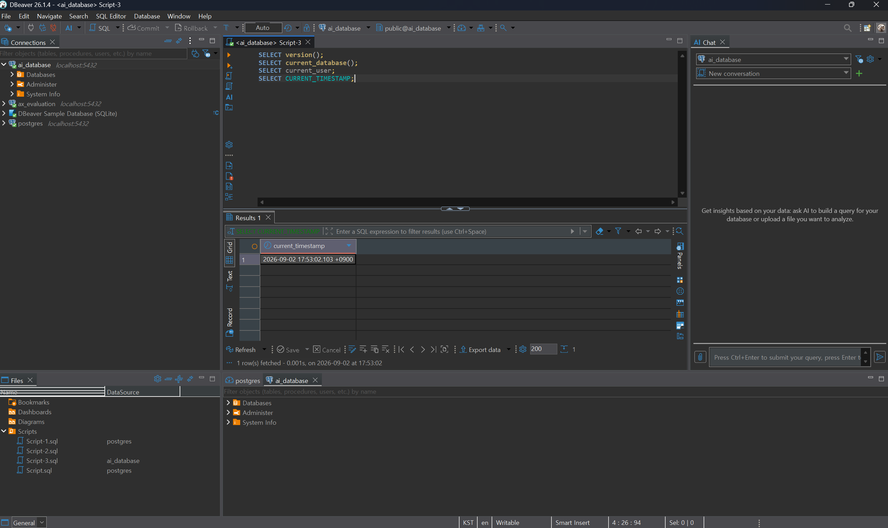
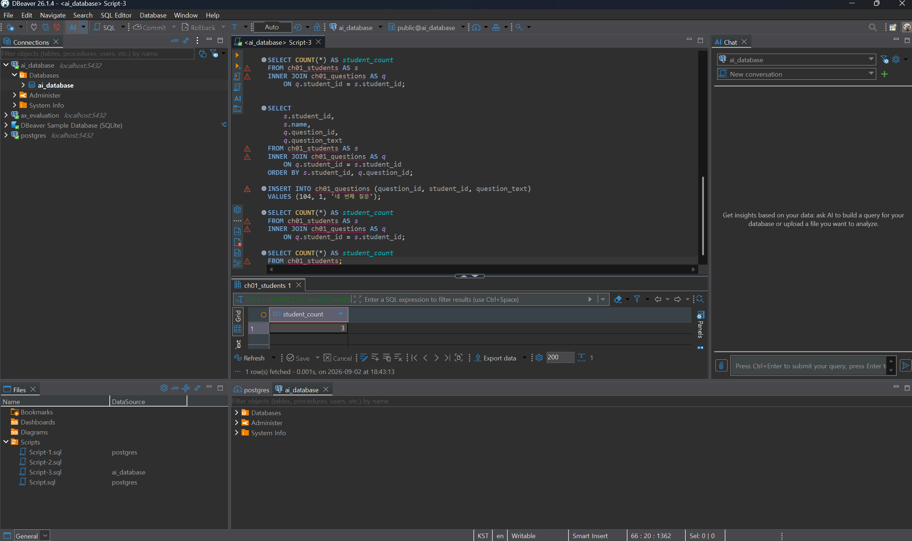
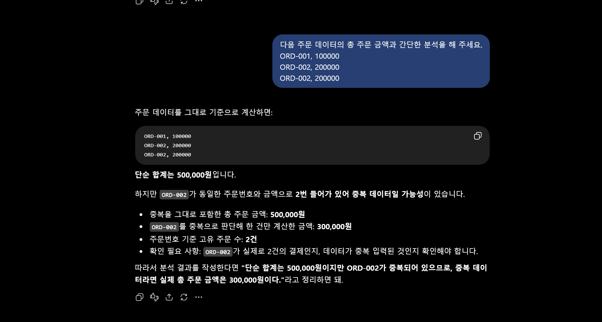

# Chapter 01 확장 실습 답안 템플릿

> **과제:** AI 시대에 데이터베이스를 왜 배워야 하는가  
> **사용 방법:** 이 파일을 내려받아 **본인의 GitHub 저장소**에 `chapter01_answer.md`라는 이름으로 저장한 뒤 답안을 작성합니다.  
> **제출 방법:** LMS에는 파일을 업로드하지 않고, **본인 GitHub 저장소의 `chapter01_answer.md` 파일 URL**을 제출합니다.

---

## 0. 학생 정보

| 항목 | 작성 내용 |
| --- | --- |
| 학번 | AX 2기 |
| 이름 | 임서현 |
| GitHub 계정 | https://github.com/lsh0555 |
| 과제 작성일 | 2026.09.02 (수) |
| 사용한 AI 도구 | ChatGPT |

> 실제 비밀번호, API Key, 전체 DB 접속 URL, 개인정보는 이 파일이나 캡처 화면에 기록하지 않습니다.

---

# 1. PostgreSQL 실행 환경 확인

## 1-1. 실행한 SQL

```sql
SELECT version();
SELECT current_database();
SELECT current_user;
SELECT CURRENT_TIMESTAMP;
```

## 1-2. 실행 결과 기록

```text
PostgreSQL 버전 : PostgreSQL 18.4 on x86_64-windows, compiled by msvc-19.44.35227, 64-bit
현재 데이터베이스 : ai_database
현재 사용자 : postgres
현재 시각 : 2026-09-02 17:46:55.139 +0900
```

## 1-3. 내가 확인한 내용

1. SQL을 작성하는 프로그램과 PostgreSQL은 같은 프로그램인가요?

```text
나의 답: 다른 프로그램이다.
```

2. `current_database()` 결과는 무엇을 의미하나요?

```text
나의 답: 현재 접속한 데이터베이스
```

3. SQL이 실행되었다는 사실만으로 데이터 내용도 올바르다고 할 수 있나요?

```text
나의 답: 아니요
```

## 1-4. 증거 화면

아래 경로에 캡처 이미지를 저장하는 것을 권장합니다.

```text
assignments/chapter01/images/step01_environment.png
```

이미지를 저장했다면 아래 링크의 파일명을 실제 파일명에 맞게 수정합니다.

```markdown

```

**이미지 삽입 위치:**

<!-- 아래 줄의 주석을 지우고 실제 이미지 Markdown을 넣어도 됩니다. -->

`여기에 STEP 1 증거 화면을 삽입하세요.`

---

# 2. Chapter 01 핵심 내용 복습

교재 문장을 그대로 복사하지 말고 자신의 말로 작성합니다.

| 본문의 핵심 | 나의 설명 |
| --- | --- |
| AI가 SQL을 만들어도 DB를 배워야 한다 | AI가 만든 결과를 검증하고 정확한 분석과 의사 결정을 하기 위해서 DB를 배워야 한다. |
| 데이터 구조가 중요하다 | 계속 바뀌는 요구사항에 대처하기 위해 데이터의 의미와 관계를 명확히 하고, 변경 내용을 검증하면서 확장해야 한다. |
| SQL 결과를 검증해야 한다 | 요구사항에 맞는 결과가 나왔는지 확인이 필요하다. |
| 데이터 품질이 AI 답변 품질에 영향을 준다 | 잘못된 SQL 결과나 AI 분석 및 의사결정의 오류 문제가 발생 할 수 있다. |
| 저장 방식은 데이터 양만 보고 선택하지 않는다 | 데이터 관계, 동시 작업, 반복 조회, 권한과 요구사항을 보고 선택해야 한다. |

## 가장 중요하다고 생각한 한 문장

```text
데이터베이스를 배우는 중요한 이유 중 하나는 AI 답변의 근거가 되는 데이터를 추적하고 검증하기 위해서이다.
```

---

# 3. 실행 성공과 결과 정확성의 차이

## 3-1. SQL 실행 전 예상

학생 A는 질문 2개, 학생 B는 질문 1개, 학생 C는 질문이 없습니다.

```text
전체 학생 수: ____3__ 명
전체 질문 수: ____3__ 개
질문이 있는 학생 수: ___2___ 명
질문이 없는 학생 수: ___1___ 명
```

## 3-2. 임시 테이블 생성 및 데이터 입력 완료 확인

- [O] `ch01_students` 생성
- [O] `ch01_questions` 생성
- [O] 학생 3명 입력
- [O] 질문 3건 입력
- [O] 두 테이블의 데이터를 직접 조회

## 3-3. 잘못된 학생 수 SQL 실행 결과

실행한 SQL:

```sql
SELECT COUNT(*) AS student_count
FROM ch01_students AS s
INNER JOIN ch01_questions AS q
    ON q.student_id = s.student_id;
```

실행 결과:

```text
3
```

## 3-4. JOIN 상세 결과 관찰

```text
학생 A가 나타난 행 수 : 3행
학생 B가 나타난 행 수 : 1행
학생 C가 나타난 행 수 : 0행
```

다음 질문에 답합니다.

### Q1. 학생 C가 왜 결과에서 사라졌나요?

```text
학생 C는 질문을 제출하지 않았기 때문이다.
```

### Q2. 학생 A가 왜 여러 행으로 나타났나요?

```text
학생 A는 질문을 세번 했기 때문에 여러 행이 나온다.
```

### Q3. 위 `COUNT(*)`가 실제로 세고 있었던 것은 무엇인가요?

```text
제출 된 질문의 갯수
```

### Q4. 결과 숫자가 우연히 실제 학생 수와 같아도 바로 믿으면 안 되는 이유는 무엇인가요?

```text
요구사항에 해당하는 데이터를 읽고 알맞은 결과를 가지고 왔는지 결과 숫자만으로는 확인 할 수 없기 때문이다.
```

## 3-5. 질문 한 건을 추가한 뒤 다시 실행

추가한 데이터:

```text
104, 1, '네 번째 질문'
```

다시 실행한 결과 : 4

```text
AI SQL 결과 : 4
실제 학생 수 : 3
```

### 결과 해석

```text
데이터가 바뀐 뒤 무엇이 달라졌는지 : 질문 갯수가 하나 더 늘었다. 3개에서 4개가 되었다.

실제 학생 수는 왜 그대로인지 : 학생 A가 질문을 하나 더 한 것이기에 학생 수는 늘어나지 않는다.

이 실험을 통해 알게 된 점 : 어떤 것을 카운트 한 결과인지 정확히 구분해야 할 것 같다.
```

## 3-6. 학생 테이블을 직접 센 결과

```sql
SELECT COUNT(*) AS student_count
FROM ch01_students;
```

결과:

```text
3
```

### 두 SQL의 차이를 내 말로 설명

```text
첫 번째 SQL은 ____________학생들의 질문 갯수_____________________을 세고 있었다.

두 번째 SQL은 ___총 학생 인원______________________을 세고 있었다.

따라서 SQL을 검토할 때는 문법보다 먼저
___________결과를 보고 요구사항이 결과에 잘 반영이 되었는지_______________을 확인해야 한다.
```

## 3-7. 증거 화면

권장 경로:

```text
assignments/chapter01/images/step03_join_result.png
```

`여기에 STEP 3 핵심 증거 화면을 삽입하세요.`

---

# 4. 잘못된 데이터가 결과를 바꾸는 과정

## 4-1. 주문 데이터 확인

다음 데이터를 입력한 뒤 실제 결과를 확인합니다.

```text
ORD-001, 100000
ORD-002, 200000
ORD-002, 200000
```

## 4-2. 실행 전 예상

업무적으로 주문이 `ORD-001`, `ORD-002` 두 건이고 `order_code`가 주문을 고유하게 구분한다고 **가정할 경우** 예상 합계:

```text
____300000__ 원
```

> 위 가정 자체가 실제 업무 규칙인지 확인해야 한다는 점도 기억합니다.

## 4-3. SQL 합계

```sql
SELECT SUM(amount) AS total_amount
FROM ch01_orders;
```

실제 결과:

```text
_____500000_____ 원
```

## 4-4. 결과 해석

### `SUM` 문법 자체가 잘못된 것인가요?

```text
아니요
```

### 결과 차이의 원인은 무엇인가요?

```text
order_code가 주문을 고유하게 구분한다는 부분이 반영이 되지 않았다.
```

### SQL이 정확하게 실행되어도 업무 숫자가 잘못될 수 있는 이유를 설명하세요.

```text
데이터가 잘못 되었기 때문이다.
```

## 4-5. AI에게 같은 데이터를 분석시킨 결과

AI가 계산한 합계:

```text
500,000원
```

AI가 중복 가능성을 언급했나요?

```text
네. 같은 주문번호와 같은 금액으로 두 번 존재하므로 중복 데이터일 가능성을 언급했다.
```

AI가 `ORD-002` 두 행이 실제 두 주문인지 중복 입력인지 스스로 확정할 수 있나요? 이유도 적으세요.

```text
아니요. 현재 데이터만으로는 실제 두 주문인지 단순 중복 입력인지 확정할 수 없다.
```

추가로 확인해야 할 업무 규칙:

```text
1. 주문번호가 고유한 값인지
2. 하나의 주문번호에 여러 결제/주문 내역이 존재할 수 있는지
3. 중복 데이터는 합계에서 제외해야 하는지
```

내가 최종적으로 내린 판단:

```text
현재 정보만으로 ORD-002를 임의로 제거하지 않고 총액은 500,000원으로 계산하되, ORD-002의 중복 여부를 확인한 후 최종 금액을 확정해야 한다.
```

## 4-6. 증거 화면

권장 경로:

```text
assignments/chapter01/images/step04_duplicate_result.png
```

`여기에 STEP 4 핵심 증거 화면을 삽입하세요.`

---

# 5. 파일·스프레드시트·DBMS 선택 연습

각 사례에 대해 **AI에게 묻기 전에 먼저 본인의 판단을 작성**합니다.

## 사례 A. 개인 독서 기록

```text
나의 선택 : 파일
선택 이유 : 복잡한 관계나 권한이 필요 없기 때문이다.
어떤 조건이 추가되면 다른 방식으로 바꿀 것인지: 여러 사람이 사용하게 될 경우 DBMS 방식으로 바꾼다.
```

## 사례 B. 동아리 행사 신청 명단

```text
나의 선택 : 스프레드시트
선택 이유 : 이름, 연락처, 참석 여부를 스프레드시트로 관리하면 참석률 계산이 쉬워질 것 같기 때문이다.
어떤 조건이 추가되면 다른 방식으로 바꿀 것인지 : 장기간 운영하며 여러 행사들을 동시에 관리하게 되면 DBMS 방식으로 바꾼다.
```

## 사례 C. 온라인 강의 서비스

```text
나의 선택 : DBMS
선택 이유 : 사용자가 여러명이고 관리해야 할 파일이나 조건이 많기 때문이다.
어떤 조건이 추가되면 다른 방식으로 바꿀 것인지 : 바꾸지 않고 DBMS로 계속 사용 할 것 같다.
```

## 판단 기준 체크

- [O] 데이터 증가
- [O] 여러 사용자의 동시 수정
- [O] 데이터 사이의 관계
- [O] 반복 조회와 집계
- [O] 정확성·일관성
- [O] 변경 이력
- [O] 권한 구분
- [O] 백업·복구
- [O] 웹·앱에서 지속 사용

### 데이터가 적으면 무조건 스프레드시트를 사용해야 하나요?

```text
나의 답 : 아니요
```

---

# 6. 나만의 서비스 데이터 구조 초안

> 이 내용은 이후 Chapter에서 계속 확장할 수 있으므로 신중하게 작성합니다.

## 6-1. 서비스 정의

```text
서비스 이름 : 스터디 모임 관리

이 서비스는 스터디 모임을 관리
______________________________________________________________
하기 위한 서비스이다.
```

## 6-2. 관리할 데이터 후보

```text
1. 스터디 참여자
2. 스터디 날짜
3. 스터디 장소
4. 스터디 할 과목
5. 스터디 참여 여부
```

## 6-3. 한 행의 의미

| 데이터 후보 | 한 행의 의미 |
| --- | --- |
| 참여자 데이터 한 행 | 참여자 한 명 |
| 스터디 할 과목 한 행 | 스터디 모임 한 개 |
| 스터디 참여 여부 한 행 | 참가자의 스터디 참여 여부 한 건 |

## 6-4. 관계를 자연어로 설명

```text
1. 한 명의 스터디 참여자는 여러 스터디 모임에 참여할 수 있다.
2. 하나의 스터디 모임에는 5명까지 참여가 가능하다.
3. 스터디 모임은 한 번으로 끝나지 않고 여러 회차로 진행된다.
```

## 6-5. 아직 결정하지 않은 정책

```text
Q1. 스터디 모임을 중간에 나가게 되면 해당 스터디 참여자의 기록은 삭제 되는가?
Q2. 동명이인의 스터디 모임 참여자들을 어떻게 구별 할 것인가?
Q3. 하나의 스터디 과목으로 여러개의 스터디 모임이 생성 될 수 있는가?
```

> 확정되지 않은 정책을 AI가 임의로 결정한 경우 그대로 받아들이지 않습니다.

---

# 7. AI를 검토자로 활용하기

## 7-1. 내가 AI에게 전달한 핵심 프롬프트

개인정보나 비밀번호 등 민감한 내용은 제거한 뒤 기록합니다.

```text
나는 데이터베이스를 처음 배우는 학생입니다.
아직 ERD나 정규화를 배우기 전입니다.
내가 생각한 서비스는 다음과 같습니다.

서비스: 스터디 모임 관리

목적: 스터디 모임을 관리하기 위해서

관리할 데이터 후보:
- 스터디 참여자
- 스터디 날짜
- 스터디 장소
- 스터디 할 과목
- 스터디 참여 여부

내가 생각한 관계:
- 한 명의 스터디 참여자는 여러 스터디 모임에 참여할 수 있다.
- 하나의 스터디 모임에는 5명까지 참여가 가능하다.
- 스터디 모임은 한 번으로 끝나지 않고 여러 회차로 진행된다.

아직 결정하지 못한 정책:
- 스터디 모임을 중간에 나가게 되면 해당 스터디 참여자의 기록은 삭제 되는가?
- 동명이인의 스터디 모임 참여자들을 어떻게 구별 할 것인가?
- 하나의 스터디 과목으로 여러개의 스터디 모임이 생성 될 수 있는가?

지금 단계에서는 완성된 SQL을 만들지 말고,
1. 내가 놓친 데이터가 있는지,
2. 서로 다른 의미의 데이터를 한 항목으로 섞은 것은 없는지,
3. 추가로 확인해야 할 업무 질문은 무엇인지,
4. 파일·스프레드시트·관계형 DBMS 중 무엇이 적합해 보이는지

초보자가 이해할 수 있게 검토해 주세요.
확정되지 않은 정책은 임의로 정답처럼 결정하지 마세요.
```

## 7-2. AI의 주요 제안과 나의 판단

최소 5개를 작성합니다.

| AI의 제안 | 수용 / 수정 / 거절 | 나의 판단 근거 |
| --- | --- | --- |
| 최대 5명 규칙은 스터디 전체 기준인가, 회차 기준인가? | 수정 | 최대 5명 규칙은 스터디 모임 하나의 모든 회차에 적용하여 모두 같은 조건으로 참여할 수 있게 한다.|
| 스터디 날짜와 장소는 매 회차마다 바뀔 수 있는가? | 수용 | 상황에 따라 스터디 날짜와 장소가 매 회차마다 바뀔 가능성이 있다. |
| 참여 여부는 “모임 가입 여부”인지 “그날 출석 여부”인지? | 수정 | 모임 가입 여부를 하나 더 만들고, 참여 여부는 스터디 모임의 각 회차 출석 여부로 수정해야 각 스터디 모임의 참여자 관리에 혼동이 없을 것 같다. |
| 스터디 탈퇴 후 과거 출석 기록은 남겨야 하는가? | 수용 | 스터디 탈퇴 후 과거 출석 기록을 남겨야 해당 참여자가 다른 스터디 모임에 가입 할 때 과거 출석 기록을 참고하는 것이 스터디 모임 분위기 조성에 도움이 될 것 같다. |
| 스터디 과목 이름이 바뀌면 기존 모임 기록도 같이 바뀌어야 하는가? | 거절 | 스터디 모임은 한 번 만들어지면 스터디 과목 이름 수정이 불가하게 만들어야 스터디 도중 과목이름이 바뀌면서 주는 혼란을 줄일 수 있을 것 같다. |

## 7-3. AI에게 자기 답변을 다시 비판하도록 요청한 결과

첫 번째 답변과 달라진 점:

```text
최대 5명 규칙의 적용 기준, 탈퇴자의 과거 출석 기록 활용, 스터디 과목명 수정 금지 등은 추가 확인이 필요한 정책이라는 점을 알게 되었다.
```

AI가 처음에 임의로 가정했던 내용:

```text
AI는 요구사항에 명시되지 않은 스터디 모임 이름, 모임 상태, 회차 정보, 참여 신청 정보 등이 필요할 수 있다고 추가로 제안했다. 또한 참여 여부가 특정 모임이나 회차의 참여 정보일 가능성과 스터디 모임과 회차를 분리해서 관리할 가능성을 제시했다. 이러한 내용은 실제 업무 정책이 확인되기 전에 AI가 추론하여 제안한 내용이므로 담당자의 확인이 필요하다.
```

추가로 업무 담당자에게 확인해야 한다고 판단한 내용:

```text
최대 5명의 기준이 모임 전체인지 회차별 참석 인원인지, 탈퇴자의 출석 기록을 계속 보관할 것인지와 누가 조회할 수 있는지, 과목명 수정이 가능한지와 수정 이력을 남길 것인지 확인해야 한다. 또한 동명이인 참여자를 어떻게 구분할지, 회차별 날짜와 장소 변경 및 변경 이력을 어떻게 관리할지도 확인할 필요가 있다.
```

## 7-4. AI 활용에 대한 나의 평가

```text
가장 유용했던 부분 : 내가 생각하지 못 한 부분을 추가로 얘기해준게 가장 유용했다.

수정하거나 거절한 부분 : 스터디 최대 5명 규칙의 적용 기준, 탈퇴자의 과거 출석 기록 활용, 스터디 과목명 수정 여부처럼 아직 정해지지 않은 내용들을 확정해서 판단하는 부분은 수정하거나 보류했다.

그렇게 판단한 근거 : 아직 정해지지 않은 부분이기에 내 마음대로 확정을 짓는 것보다 전체적인 흐름을 보면서 확인해야 할 것 같았다.

AI가 없었다면 놓쳤을 가능성이 있는 질문 : 스터디 참여 여부가 모임 가입 여부인지 회차별 출석 여부인지, 그리고 스터디 날짜와 장소가 회차마다 변경될 수 있는지에 대한 질문
```

## 7-5. AI 활용 증거 화면

권장 경로:

```text
assignments/chapter01/images/step07_ai_review.png
```

AI 대화 전체를 캡처할 필요는 없습니다. 핵심 요청과 검토 과정이 보이는 화면 1장 정도면 충분합니다.

`여기에 AI 활용 증거 화면을 삽입하세요.`

---

# 8. 기준 데이터·파생 데이터·AI 생성 결과 구분

내 서비스에 맞게 작성합니다.

| 구분 | 내 서비스의 예 | 판단 이유 |
| --- | --- | --- |
| 기준 데이터 | 스터디 참여 여부 | 원본 후보 |
| 파생 데이터 | 참여자별 출석률 | 회차별 출석 기록을 집계해 만든 데이터 |
| AI 생성 결과 | AI가 작성한 스터디 참여 현황 분석 | 출석 기록과 출석률 등 데이터를 바탕으로 만든 결과 |

### 기준 데이터가 변경되면 파생 데이터는 어떻게 해야 하나요?

```text
기준 데이터가 변경되면 해당 데이터를 이용해 만든 파생 데이터도 다시 계산해야 한다.
```

### AI 결과만 있고 원본 데이터가 없다면 결과를 충분히 검증할 수 있나요?

```text
충분히 검증할 수 없다.
AI가 작성한 스터디 참여 현황 분석만 있고 원본인 회차별 출석 기록이 없다면, AI가 실제 데이터를 정확하게 반영하여 분석했는지 확인하기 어렵다.
```

---

# 9. 최종 성찰

아래 세 문장은 반드시 **본인의 말**로 작성합니다.

```text
1. SQL이 실행되어도 결과를 바로 믿으면 안 되는 이유는
   오류 없이 실행되더라도 내가 원하는 데이터를 정확하게 조회하여 사용 한 것인지 확인해야 하기 때문이다.

2. AI를 데이터베이스 학습에 활용할 때 가장 중요한 것은
   AI의 답을 그대로 믿지 않고 내가 직접 데이터와 실행 결과를 확인하고 판단하는 것이다.

3. 이번 실습 이후 내가 더 확인하고 싶은 것은
   실제 서비스에서 기준 데이터와 파생 데이터를 어떻게 구분하고 관리하는가이다.
```

## 이번 Chapter에서 새롭게 알게 된 점 3가지

```text
1. SQL이 오류 없이 실행되더라도 원하는 결과가 나온 것인지 직접 확인해야 한다.
2. AI의 답변을 그대로 믿지 않고, 실제 데이터와 업무 요구사항을 기준으로 검토하고 판단해야 한다.
3. 데이터를 설계하기 전에 확정된 요구사항과 아직 결정되지 않은 업무 정책을 구분해야 한다는 것을 알게 되었다.
```

## 아직 이해가 명확하지 않은 부분

```text
1. 
2.
```

---

# 10. 제출 전 자기 점검

- [O] PostgreSQL 실행 화면을 확인했다.
- [O] SQL 실행 전에 예상 결과를 먼저 작성했다.
- [O] `INNER JOIN` 예제에서 누락과 반복을 설명할 수 있다.
- [O] 숫자가 우연히 같아도 의미가 다를 수 있음을 설명했다.
- [O] 중복 데이터가 집계 결과에 미치는 영향을 확인했다.
- [O] 저장 방식을 데이터 양만으로 판단하지 않았다.
- [O] 개인 서비스 주제를 하나 정했다.
- [O] 데이터 후보와 한 행의 의미를 작성했다.
- [O] 미확정 정책을 최소 3개 작성했다.
- [O] AI 제안을 수용·수정·거절로 구분했다.
- [O] AI 제안에 대한 판단 근거를 작성했다.
- [O] 기준 데이터·파생 데이터·AI 결과를 구분했다.
- [O] 핵심 증거 이미지가 Markdown에서 정상적으로 보인다.
- [O] 비밀번호·API Key·개인정보가 노출되지 않았다.

---

# 11. LMS 제출 정보

## 내 GitHub 답안 파일 URL

아래에는 **교수자 템플릿 URL이 아니라 본인이 작성한 답안 파일의 GitHub URL**을 기록합니다.

```text
https://github.com/<본인-GitHub-ID>/<본인-저장소>/blob/main/assignments/chapter01/chapter01_answer.md
```

내 실제 제출 URL:

```text
https://github.com/lsh0555/ai_database/blob/main/assignments/chapter01/chapter01_answer.md
```

> LMS에는 위 **본인 저장소의 `chapter01_answer.md` 파일 URL 하나**를 제출합니다.

---

## 권장 학생 저장소 구조

```text
<본인-저장소>/
└── assignments/
    └── chapter01/
        ├── chapter01_answer.md
        └── images/
            ├── step01_environment.png
            ├── step03_join_result.png
            ├── step04_duplicate_result.png
            └── step07_ai_review.png
```

이 구조를 사용하면 이후 Chapter 02, Chapter 03도 같은 방식으로 계속 추가할 수 있습니다.