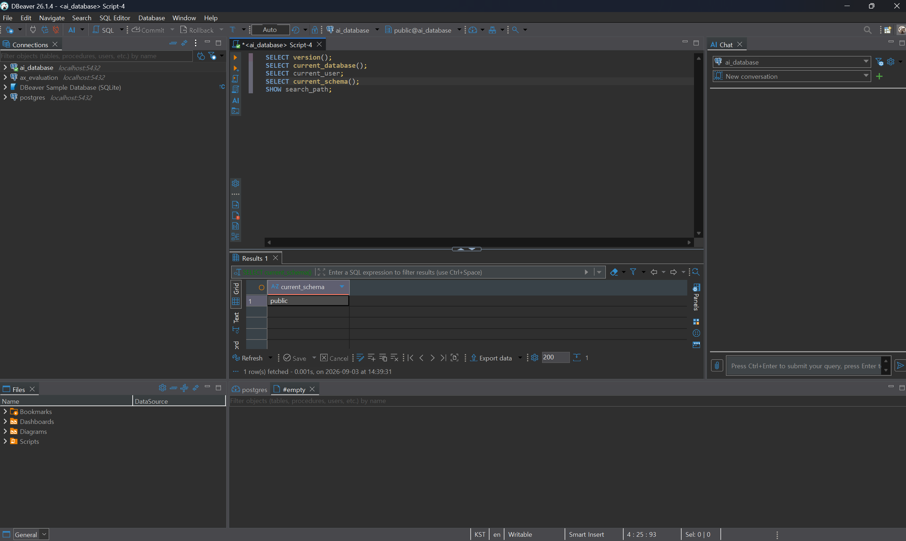
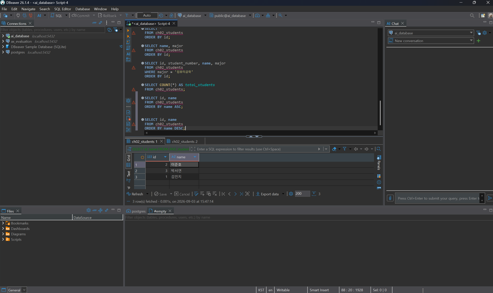
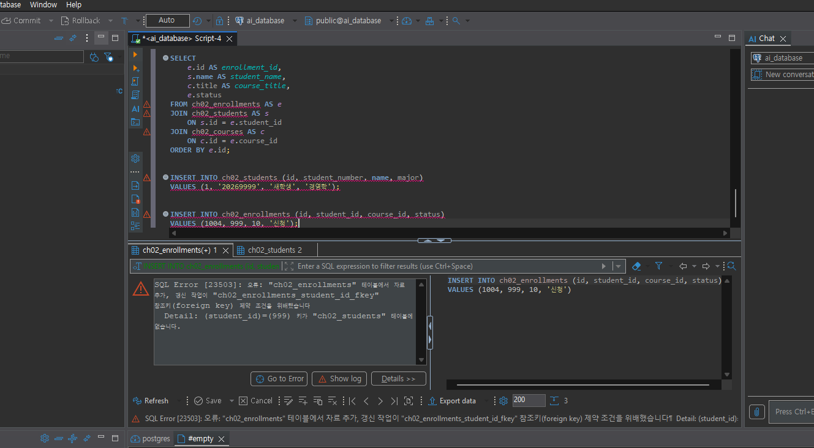
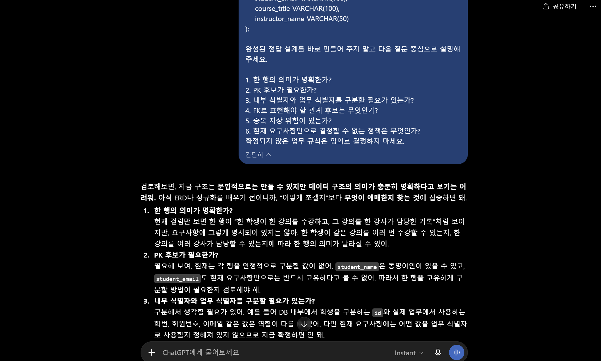

# Chapter 02 확장 실습 답안 템플릿

> **과제:** 데이터와 DBMS의 기본 개념  
> **사용 방법:** 이 파일을 내려받아 본인의 GitHub 저장소에 `chapter02_answer.md`라는 이름으로 저장한 뒤 실습하면서 바로 작성합니다.  
> **제출 방법:** LMS에는 파일을 직접 업로드하지 않고, **본인 GitHub 저장소의 `chapter02_answer.md` 파일 URL**을 제출합니다.

---

## 제출 전 개인정보 주의

LMS에서 제출자를 확인할 수 있으므로 이 공개 Markdown 파일에 학번이나 실명을 반드시 적을 필요는 없습니다.

```text
GitHub 계정 또는 별칭 : https://github.com/lsh0555
과제 작성일 : 2026-09-03
사용한 AI 도구 : ChatGPT
```

> 실제 비밀번호, API Key, 전체 DB 접속 URL, 개인정보가 포함된 화면은 올리지 않습니다.

---

# 1. PostgreSQL에서 현재 위치 확인

## 1-1. 실행한 SQL

```sql
SELECT version();
SELECT current_database();
SELECT current_user;
SELECT current_schema();
SHOW search_path;
```

## 1-2. 실행 결과 기록

```text
PostgreSQL 버전 : PostgreSQL 18.4 on x86_64-windows, compiled by msvc-19.44.35227, 64-bit
현재 데이터베이스 : ai_database
현재 사용자 : postgres
현재 스키마 : public
search_path : "$user", public
```

## 1-3. 구조를 내 말로 설명

```text
PostgreSQL은 : DBMS

현재 접속한 데이터베이스는 : ai_database

스키마는 : public

DBeaver 또는 psql 같은 도구는 : 데이터베이스 클라이언트
```

## 1-4. 계층 구조 완성

```text
사용자
→ DBeaver와 같은 클라이언트
→ PostgreSQL DBMS
→ 데이터베이스
→ 스키마
→ 테이블
→ 행 / 열
```

## 1-5. 증거 화면

권장 경로:

```text
assignments/chapter02/images/step01_environment.png
```

```markdown

```


---

# 2. 데이터베이스 안의 스키마와 테이블 관찰

## 2-1. 스키마 조회 결과

실행한 SQL:

```sql
SELECT schema_name
FROM information_schema.schemata
ORDER BY schema_name;
```

관찰한 스키마 이름 중 3개 이내를 적습니다.

```text
1. information_schema
2. pg_catalog
3. pg_temp_64
```

### `public`은 무엇인가요?

```text
나의 설명 : 스키마
```

### 데이터베이스와 스키마는 같은 것인가요?

```text
나의 설명 : 다르다. 데이터베이스 안에 스키마가 있고, 스키마 안에 테이블이 있다.
```

## 2-2. 현재 보이는 테이블 조회

```sql
SELECT table_schema, table_name
FROM information_schema.tables
WHERE table_type = 'BASE TABLE'
  AND table_schema NOT IN ('pg_catalog', 'information_schema')
ORDER BY table_schema, table_name;
```

```text
조회된 사용자 테이블 수 또는 눈에 띈 테이블 : 없다.

아직 테이블이 거의 없어도 괜찮은 이유 : 아직 수업용 테이블을 만들지 않았기 때문이다.
```

## 2-3. 관찰 정리

```text
PostgreSQL 서버 안에는 여러 _________데이터베이스________가 있을 수 있다.
한 데이터베이스 안에는 여러 ______스키마_____가 있을 수 있다.
스키마 안에는 테이블과 같은 _______여러 객체_______가 존재한다.
```

---

# 3. TEMP TABLE로 테이블·행·열·키 직접 확인

## 3-1. 임시 테이블 생성 완료 확인

- [O] `ch02_students` 생성
- [O] `ch02_courses` 생성
- [O] `ch02_enrollments` 생성

각 테이블의 **한 행 의미**를 적습니다.

| 테이블 | 한 행의 의미 |
| --- | --- |
| `ch02_students` | 학생 한 명 |
| `ch02_courses` | 강의 한 개 |
| `ch02_enrollments` | 특정 학생이 특정 강의를 신청한 사건 한 건 |

## 3-2. 열의 의미 확인

### `ch02_students`

| 열 | 값의 의미 | 내부 식별자 / 업무 식별자 / 일반 속성 |
| --- | --- | --- |
| `id` | DB 내부에서 학생 행을 구분하는 내부 식별자 후보 | 내부 식별자 |
| `student_number` | 학교 업무에서 사용하는 업무 식별자 후보 | 업무 식별자 |
| `name` | 학생 이름 | 일반 속성 |
| `major` | 전공 | 일반 속성 |

### `ch02_enrollments`

| 열 | 값의 의미 | PK / FK / 일반 속성 |
| --- | --- | --- |
| `id` | 수강신청 기록을 구분하는 고유 식별자 | PK |
| `student_id` | 어떤 학생이 신청했는지를 나타내는 값 | FK |
| `course_id` | 어떤 강의를 신청했는지를 나타내는 값 | FK |
| `status` | 수강신청의 현재 상태 | 일반 속성 |

## 3-3. 입력된 행 수

```text
students 행 수 : 3
courses 행 수 : 2
enrollments 행 수 : 3
```

## 3-4. 내부 식별자와 업무 식별자

```text
students.id가 필요한 이유 : DB 내부에서 각 학생 데이터를 안정적으로 구분하기 위해 필요하다.

student_number가 필요한 이유 : 학교 업무에서 학생을 식별하기 위해 사용하는 학번이 필요하기 때문이다.

둘을 항상 같은 값으로 사용하지 않아도 되는 이유 : id는 데이터베이스 내부에서 사용하는 식별자이고, student_number는 실제 학교 업무에서 사용하는 식별자이므로 역할이 서로 다르기 때문이다.
```

## 3-5. 숫자처럼 보이는 학번을 문자열로 저장한 이유

```text
나의 설명 : 학번은 계산하는 숫자가 아니라 학생을 구분하는 식별자이기 때문이다.
```

---

# 4. 테이블과 조회 결과는 다르다

## 4-1. 원본 테이블 행 수

```text
ch02_students 전체 행 수 : 3
```

## 4-2. 일부 열만 조회

실행 SQL : 

```sql
SELECT name, major
FROM ch02_students
ORDER BY id;
```

```text
원본 테이블의 열 수와 조회 결과의 열 수가 다른 이유 : SELECT에서 원본 테이블의 모든 열을 조회하지 않고 name과 major 열만 선택해서 조회했기 때문이다.
```

## 4-3. 조건을 적용한 조회

실행 SQL:

```sql
SELECT id, student_number, name, major
FROM ch02_students
WHERE major = '컴퓨터공학'
ORDER BY id;
```

```text
원본 테이블 행 수 : 3
조회 결과 행 수 : 2
원본 테이블의 데이터가 삭제된 것인가? : 아니요
그렇게 판단한 이유 : 전체 학생 3명 중 컴퓨터공학 전공인 학생 2명만 조회된 것이며, 학생의 데이터가 삭제된 것은 아니기 때문이다.
```

## 4-4. 정렬 결과 비교

```sql
SELECT id, name
FROM ch02_students
ORDER BY name ASC;

SELECT id, name
FROM ch02_students
ORDER BY name DESC;
```

```text
ASC 결과의 첫 학생 : 김민지
DESC 결과의 첫 학생 : 이준호

이 실험을 통해 ORDER BY에 대해 알게 된 점 : ORDER BY로 결과 순서를 정리한다.
```

## 4-5. 증거 화면

권장 경로:

```text
assignments/chapter02/images/step04_result_set.png
```



---

# 5. PK와 FK를 실제로 관찰

## 5-1. 정상 데이터의 관계 읽기

다음 SQL 결과를 보고 작성합니다.

```sql
SELECT
    e.id AS enrollment_id,
    s.name AS student_name,
    c.title AS course_title,
    e.status
FROM ch02_enrollments AS e
JOIN ch02_students AS s
    ON s.id = e.student_id
JOIN ch02_courses AS c
    ON c.id = e.course_id
ORDER BY e.id;
```

```text
한 행이 의미하는 것 : 한 학생이 하나의 강의를 수강 신청한 기록

같은 student_id가 여러 enrollment 행에서 반복될 수 있는 이유 : 한 학생이 여러 강의를 수강 신청할 수 있기 때문이다.

같은 course_id가 여러 enrollment 행에서 반복될 수 있는 이유 : 하나의 강의를 여러 학생이 수강 신청할 수 있기 때문이다.
```

## 5-2. 기본키 중복 오류 관찰

중복 PK 입력을 시도한 결과:

```text
실행 성공 / 실패 : 실패
오류 메시지에서 확인한 핵심 단어 : 중복된 키 값이 "ch02_students_pkey" 고유 제약 조건을 위반함
왜 실패했다고 생각하는가 : id가 1인 PK 데이터가 이미 있기 때문이다.
```

## 5-3. 존재하지 않는 학생을 참조하는 FK 오류 관찰

존재하지 않는 `student_id`를 사용한 수강신청 입력 결과:

```text
실행 성공 / 실패 : 실패
오류 메시지에서 확인한 핵심 단어 : "ch02_enrollments" 테이블에서 자료 추가, 갱신 작업이 "ch02_enrollments_student_id_fkey" 참조키(foreign key) 제약 조건을 위배함
왜 실패했다고 생각하는가 : student_id가 999인 키가 "ch02_students" 테이블에 없기 때문이다.
```

## 5-4. PK와 FK의 차이 정리

```text
PK는 ____테이블에서 각 행을 고유하게 구분 ______ 하기 위한 키이다.

FK는 _____다른 테이블의 데이터를 참조하여 테이블 사이의 관계를 연결_________ 하기 위한 키이다.

FK 값이 여러 행에서 반복될 수 있는 이유는
___하나의 데이터를 여러 행에서 참조할 수 있기_________ 때문이다.
```

## 5-5. 증거 화면

권장 경로:

```text
assignments/chapter02/images/step05_pk_fk.png
```

> 오류 메시지는 전체 화면이 아니라 테이블명·constraint·참조 오류가 보이는 정도만 캡처합니다.


---

# 6. 관계와 카디널리티를 자연어로 설명

현재 임시 데이터 기준으로 작성합니다.

```text
학생 한 명은 여러 수강신청을 가질 수 있는가? : 가질 수 있다.

강의 한 개는 여러 수강신청을 가질 수 있는가? : 가질 수 있다.

수강신청 한 건은 학생 몇 명을 참조하는가? : 학생 한 명을 참조한다.

수강신청 한 건은 강의 몇 개를 참조하는가? : 강의 한 개를 참조한다.
```

아래 구조를 완성합니다.

```text
students 1 ── __N____ enrollments ____N__ ── 1 courses
```

### 학생과 강의가 N:M 관계라고 볼 수 있는 이유

```text
나의 설명 : 한 명의 학생이 여러 강의를 수강할 수 있고, 하나의 강의에도 여러 학생이 수강할 수 있기 때문이다.
```

> 아직 0개 허용 여부, 필수 관계, 삭제 정책까지 확정하지 않습니다. 그런 규칙은 Chapter 05~06에서 다룹니다.

---

# 7. AI가 만든 테이블 구조 직접 검토

## 7-1. AI에게 묻기 전에 내가 먼저 찾은 문제

다음 구조를 보고 최소 4개를 적습니다.

```sql
CREATE TABLE student_courses (
    student_name VARCHAR(50),
    student_email VARCHAR(100),
    course_title VARCHAR(100),
    instructor_name VARCHAR(50)
);
```

```text
문제 1. PK에 해당하는 데이터가 없다.
문제 2. 학생과 강의의 관계를 연결할 FK에 해당하는 데이터가 없다.
문제 3. 서로 다른 의미의 데이터가 하나의 테이블에 함께 저장되어 있다.
문제 4. NULL을 허용해도 되는지 기준이 없다.
```

## 7-2. AI 검토 요청 프롬프트

사용한 핵심 프롬프트를 기록합니다.

```text
나는 PostgreSQL과 데이터베이스를 처음 배우는 학생입니다.
아직 정규화와 ERD를 정식으로 배우기 전입니다.
다음 테이블 구조를 검토해 주세요.
CREATE TABLE student_courses (
    student_name VARCHAR(50),
    student_email VARCHAR(100),
    course_title VARCHAR(100),
    instructor_name VARCHAR(50)
);

완성된 정답 설계를 바로 만들어 주지 말고 다음 질문 중심으로 설명해 주세요.

1. 한 행의 의미가 명확한가?
2. PK 후보가 필요한가?
3. 내부 식별자와 업무 식별자를 구분할 필요가 있는가?
4. FK로 표현해야 할 관계 후보는 무엇인가?
5. 중복 저장 위험이 있는가?
6. 현재 요구사항만으로 결정할 수 없는 정책은 무엇인가?
확정되지 않은 업무 규칙은 임의로 결정하지 마세요.
```

## 7-3. AI 제안과 나의 판단

| AI의 지적 또는 제안 | 동의 / 수정 / 보류 | 나의 근거 |
| --- | --- | --- |
| 현재 테이블에는 각 행을 고유하게 구분할 PK가 필요하다. | 동의 | 현재 구조에는 각 행을 안정적으로 구분할 값이 없기 때문이다. |
| 학생, 강의, 강사와 관련된 데이터가 한 테이블에 섞여 있을 가능성이 있다. | 동의 | 학생 정보, 강의 정보, 강사 정보는 서로 다른 의미의 데이터이므로 한 행의 의미를 명확하게 확인할 필요가 있다. |
| 학생과 강의의 관계는 FK로 표현할 필요가 있다. | 동의 | 학생과 강의를 문자열 이름만으로 연결하면 동명이인이나 이름 변경 시 문제가 생길 수 있기 때문이다. |
| student_email을 학생의 업무 식별자로 사용할 수 있다. | 보류 | 현재 요구사항만으로 이메일이 항상 고유한 값인지 알 수 없기 때문이다. |
| 같은 학생이나 강의 정보가 여러 행에서 반복되어 중복 저장될 위험이 있다. | 동의 | 한 학생이 여러 강의를 수강하거나 하나의 강의를 여러 학생이 수강하면 동일한 학생·강의 정보가 반복될 수 있기 때문이다. |

## 7-4. 본문과 대조한 항목

AI 설명 중 최소 하나를 `chapter02.md`와 비교합니다.

```text
AI가 설명한 내용 : 현재 student_courses 테이블에는 각 행을 고유하게 구분할 PK가 없기 때문에
각 행을 안정적으로 구분할 방법이 필요하다고 설명했다.

본문에서 확인한 내용 : PK는 한 테이블 안에서 각 행을 고유하게 구분하는 열 또는 열의 조합이며,
기본키 값은 중복되지 않고 NULL이 될 수 없다.

일치 / 부분 일치 / 수정 필요 : 일치

내가 최종적으로 이해한 내용 : PK는 테이블의 각 행을 서로 다른 데이터로 안정적으로 구분하기 위한 키이기 때문에 student_courses 테이블에서 고유하게 구분할 PK를 정해야 한다.
```

## 7-5. 증거 화면

권장 경로:

```text
assignments/chapter02/images/step07_ai_review.png
```

`여기에 AI 검토 과정의 핵심 화면을 삽입하세요.`

---

# 8. Chapter 01의 개인 서비스 아이디어를 DB 용어로 다시 표현

Chapter 01에서 정한 개인 서비스 주제를 그대로 사용하거나 새 주제를 정해도 됩니다.

## 8-1. 서비스 기본 정보

```text
서비스 이름 : 스터디 모임 관리
서비스 목적 : 스터디 모임을 관리하기 위해서
```

## 8-2. PostgreSQL 구조 후보

```text
데이터베이스 이름 후보 : study_management
스키마 이름 후보 : public_study
```

> 아직 실제 데이터베이스나 스키마를 생성하지 않아도 됩니다.

## 8-3. 테이블 후보와 한 행 의미

최소 3개를 작성합니다.

| 테이블 후보 | 한 행의 의미 | 내부 ID 후보 | 업무 식별자 후보 |
| --- | --- | --- | --- |
| participants | 스터디 참여자 한 명 | participant_id | 아직 미정 |
| study_groups | 스터디 모임 한 개 | study_group_id | 아직 미정 |
| study_sessions | 스터디 모임의 한 회차 | session_id | 아직 미정 |
| memberships | 참여자가 특정 스터디 모임에 가입한 기록 한 건 | membership_id | 아직 미정 |
| attendance | 참여자의 특정 회차 출석 기록 한 건 | attendance_id | 아직 미정 |

## 8-4. FK 후보

```text
1. memberships.participant_id → participants.participant_id
   이유 : 어떤 참여자가 스터디 모임에 가입했는지를 연결하기 위해서이다.

2. attendance.session_id → study_sessions.session_id
   이유 : 출석 기록이 어떤 스터디 회차에 대한 기록인지 연결하기 위해서이다.
```

## 8-5. 자연어 관계 문장

```text
1. 한 명의 참여자는 여러 스터디 모임에 참여할 수 있다.
2. 하나의 스터디 모임에는 여러 참여자가 참여할 수 있으며, 회차별 실제 참석 인원도 최대 7명까지 참여 가능하다.
3. 하나의 스터디 모임은 여러 회차로 진행될 수 있다.
```

## 8-6. 아직 확정하지 않을 정책

```text
Q1. 스터디 모임에서 탈퇴한 참여자의 가입 기록과 과거 출석 기록은 계속 보관해야 하는가?
Q2. 참여자를 고유하게 구분하기 위해 어떤 업무 식별자를 사용해야 하는가?
Q3. 하나의 스터디 과목으로 여러 개의 스터디 모임을 생성할 수 있는가?
```

---

# 9. AI를 개인 구조의 검토자로 사용

## 9-1. 사용한 프롬프트

```text
나는 데이터베이스 초보자입니다.
Chapter 02까지 학습했고 아직 ERD와 정규화는 정식으로 배우지 않았습니다.
내 서비스 구조 초안은 다음과 같습니다.

서비스 이름: 스터디 모임 관리

테이블 후보와 한 행 의미:

- participants | 스터디 참여자 한 명
- study_groups | 스터디 모임 한 개
- study_sessions | 스터디 모임의 한 회차
- memberships | 참여자가 특정 스터디 모임에 가입한 기록 한 건
- attendance | 참여자의 특정 회차 출석 기록 한 건

내부 식별자 후보:

- participant_id
- study_group_id
- session_id
- membership_id
- attendance_id

업무 식별자 후보:

- 아직 미정

FK 후보:

1. memberships.participant_id → participants.participant_id
   이유 : 어떤 참여자가 스터디 모임에 가입했는지를 연결하기 위해서이다.

2. attendance.session_id → study_sessions.session_id
   이유 : 출석 기록이 어떤 스터디 회차에 대한 기록인지 연결하기 위해서이다.

미확정 정책:

1. 스터디 모임에서 탈퇴한 참여자의 가입 기록과 과거 출석 기록은 계속 보관해야 하는가?
2. 참여자를 고유하게 구분하기 위해 어떤 업무 식별자를 사용해야 하는가?
3. 하나의 스터디 과목으로 여러 개의 스터디 모임을 생성할 수 있는가?

정답 설계를 대신 작성하지 말고 다음을 질문 형태로 검토해 주세요.

1. DBMS / database / schema / table을 혼동한 곳
2. 한 행 의미가 모호한 곳
3. 내부 식별자와 업무 식별자를 혼동한 곳
4. PK와 FK 역할을 잘못 이해한 곳
5. FK가 필요한데 빠진 관계 후보
6. 아직 업무 담당자에게 확인해야 할 정책
근거 없이 정책을 확정하지 마세요.
```

## 9-2. AI가 질문한 내용 중 유용했던 것

```text
1. memberships에 참여자뿐만 아니라 어떤 스터디 모임에 가입했는지를 연결하는 정보도 필요한지 질문한 것이 유용했다.
2. attendance에서 어떤 회차인지뿐만 아니라 어떤 참여자의 출석 기록인지도 연결해야 하는지 질문한 것이 유용했다.
3. 최대 인원, 탈퇴 기록 보관, 중복 가입 등 데이터 구조를 결정하기 전에 확인해야 할 업무 정책을 질문한 것이 유용했다.
```

## 9-3. AI가 너무 빨리 결정한 내용 또는 내가 보류한 내용

```text
1. 출석 기록이 participant를 직접 참조해야 하는지 membership을 참조해야 하는지는 아직 업무 구조가 확정되지 않아 보류했다.
2. 참여자를 구분하기 위한 업무 식별자를 이메일, 전화번호, 회원번호 중 무엇으로 사용할지는 아직 결정하지 않았다.
```

## 9-4. 검토 후 수정한 구조

| 수정 전 | 수정 후 | 수정 이유 |
| --- | --- | --- |
| memberships.participant_id만 FK 후보로 생각함 | memberships.study_group_id도 FK 후보로 검토 | 가입 기록이 어떤 스터디 모임에 대한 것인지 연결할 필요가 있기 때문 |
| attendance.session_id만 FK 후보로 생각함 | 출석한 참여자를 연결하는 FK도 필요한지 검토 | 어떤 회차인지만으로는 누구의 출석 기록인지 알 수 없기 때문 |
| study_sessions의 FK를 생각하지 않음 | study_sessions.study_group_id를 FK 후보로 검토 | 각 회차가 어떤 스터디 모임에 속하는지 연결할 필요가 있기 때문 |

---

# 10. 최종 개념 정리

아래 문장을 본인의 말로 완성합니다.

```text
PostgreSQL은 데이터를 저장하고 관리하며 SQL을 실행하는 DBMS이다.

DBeaver 또는 psql은 PostgreSQL에 접속하여 SQL을 실행할 수 있게 해주는 데이터베이스 클라이언트이다.

데이터베이스와 스키마의 차이는 데이터베이스 안에 여러 스키마가 존재할 수 있다는 것이다.

테이블 한 행은 하나의 대상이나 하나의 업무 기록을 의미이다.

조회 결과가 원본 테이블과 다른 이유는 SELECT에서 필요한 열이나 조건에 맞는 행만 선택해서 보여줄 수 있기 때문이다.

내부 식별자와 업무 식별자의 차이는 내부 식별자는 DB 내부에서 데이터를 구분하고, 업무 식별자는 실제 업무에서 대상을 구분하기 위해 사용한다는 것이다.

PK는 테이블의 각 행을 고유하게 구분하기 위한 키이다.

FK는 다른 테이블의 데이터를 참조하여 테이블 사이의 관계를 연결하기 위한 키이다.
```

---

# 11. 이번 Chapter에서 새롭게 알게 된 점

최소 3개를 작성합니다.

```text
1. PK는 테이블의 각 행을 고유하게 구분하기 위한 키이고, FK는 다른 테이블과의 관계를 연결하기 위한 키이다.
2. 데이터베이스 내부에서 사용하는 내부 식별자(id)와 학번이나 이메일처럼 실제 업무에서 사용하는 업무 식별자는 역할이 다를 수 있다.
3. 테이블을 설계하기 전에 한 행이 무엇을 의미하는지 명확하게 정하고, 중복되는 데이터와 아직 결정되지 않은 업무 정책을 먼저 확인해야 한다.
```

## 아직 헷갈리는 내용

```text
1.
2.
```

## AI에게 다시 질문하고 싶은 내용

```text

```

---

# 12. 제출 전 자기 점검

- [O] PostgreSQL에서 현재 database / schema / search_path를 확인했다.
- [O] DBMS, database, schema, table을 구분해서 설명할 수 있다.
- [O] TEMP TABLE 3개를 생성하고 직접 데이터를 조회했다.
- [O] 각 테이블의 한 행 의미를 작성했다.
- [O] 테이블과 조회 결과가 다르다는 것을 실제 SQL로 확인했다.
- [O] `ORDER BY`를 사용하지 않으면 업무 순서를 가정하면 안 된다는 점을 이해했다.
- [O] 내부 식별자와 업무 식별자의 차이를 설명할 수 있다.
- [O] PK 중복 입력 실패를 직접 확인했다.
- [O] 존재하지 않는 FK 참조 실패를 직접 확인했다.
- [O] FK 값이 반복될 수 있는 이유를 설명할 수 있다.
- [O] AI가 만든 테이블을 내가 먼저 검토했다.
- [O] AI 설명 중 최소 하나를 본문과 대조했다.
- [O] 개인 서비스의 테이블 후보를 3개 이상 작성했다.
- [O] 개인 서비스의 FK 후보와 미확정 정책을 기록했다.
- [O] 실제 비밀번호·API Key·민감한 접속 정보가 포함되지 않았는지 확인했다.
- [O] 이미지 링크가 GitHub에서 정상적으로 보이는지 확인했다.

---

# 13. GitHub 제출 정보

답안 파일 권장 위치:

```text
assignments/chapter02/chapter02_answer.md
```

이미지 권장 위치:

```text
assignments/chapter02/images/
```

LMS 제출 URL 형식:

```text
https://github.com/lsh0555/ai_database/blob/main/assignments/chapter02/chapter02_answer.md
```

## 최종 확인

- [O] 위 URL을 로그아웃 상태 또는 다른 브라우저에서 열어도 확인 가능하다.
- [O] Markdown이 정상 렌더링된다.
- [O] 이미지가 깨지지 않는다.
- [O] LMS에 교수자 템플릿 URL이 아니라 **내 답안 파일 URL**을 제출했다.