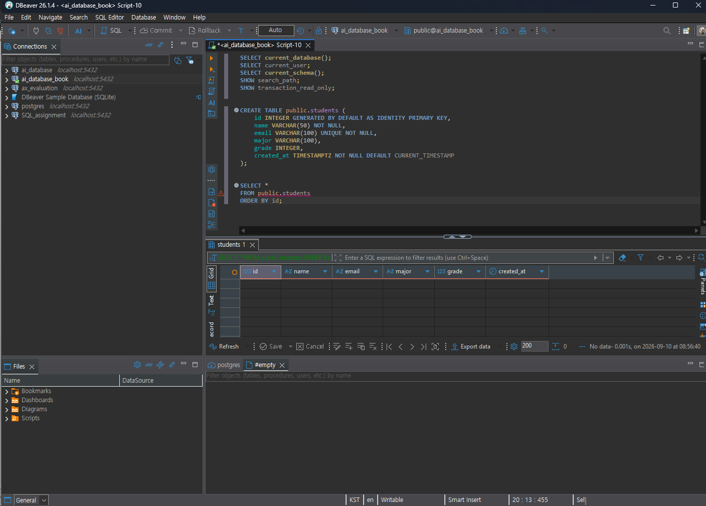
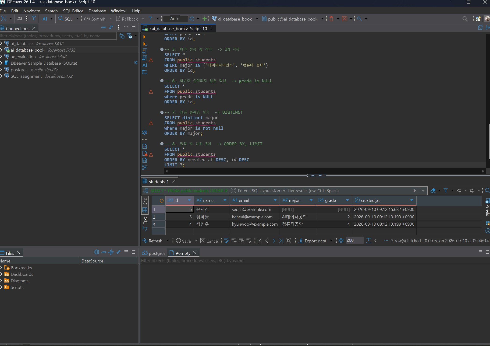
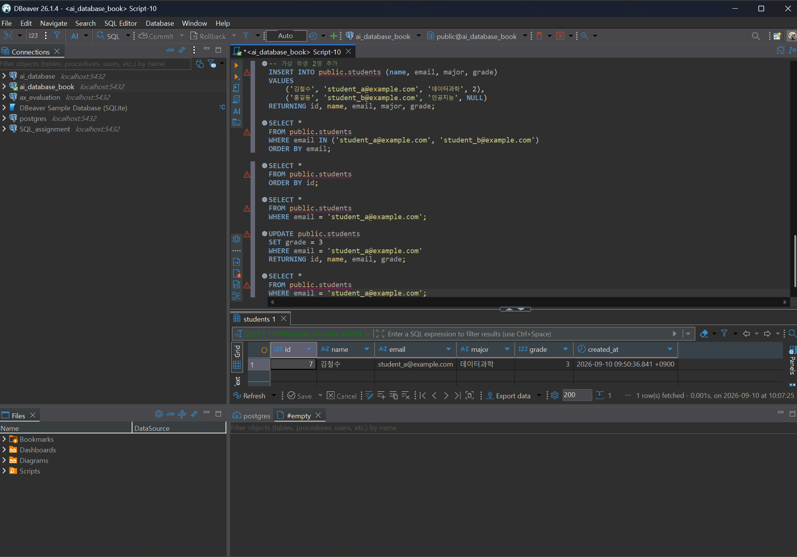
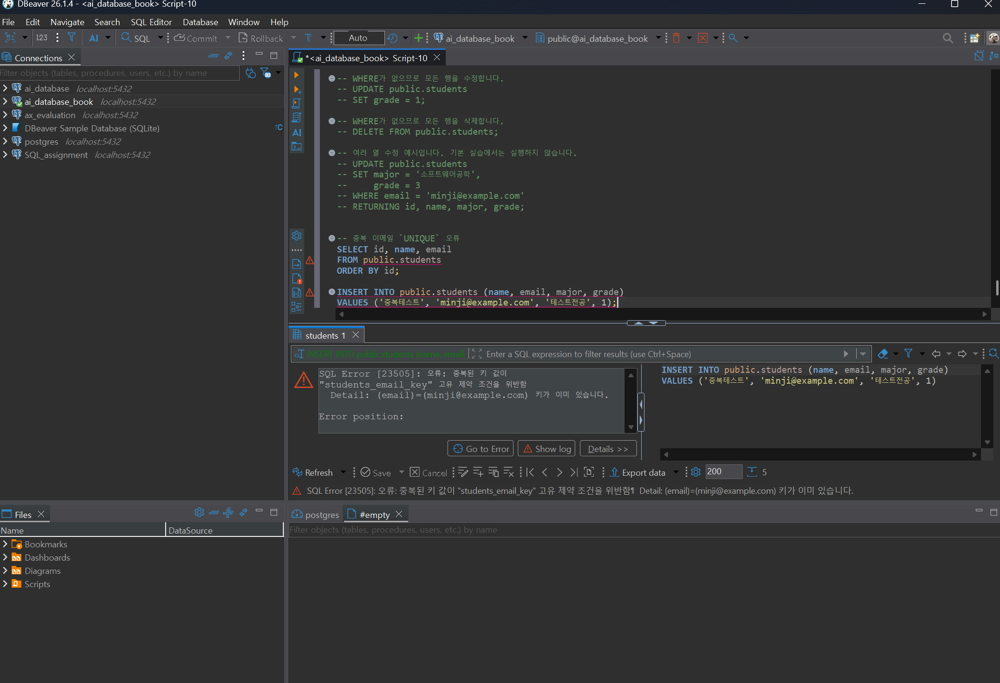

# Chapter 04 확장 실습 답안 템플릿

> **과제:** 관계형 데이터베이스와 SQL 시작하기  
> **사용 방법:** 이 파일을 내려받아 본인의 GitHub 저장소에 `chapter04_answer.md`라는 이름으로 저장한 뒤 실습하면서 바로 작성합니다.  
> **제출 방법:** LMS에는 파일을 직접 업로드하지 않고, **본인 GitHub 저장소의 `chapter04_answer.md` 파일 URL**을 제출합니다.

---

## 제출 전 주의

이 파일과 캡처 화면에는 실제 비밀번호, 전체 DB 접속 URL, API Key, 개인정보를 기록하지 않습니다.

```text
GitHub 계정 또는 별칭 : https://github.com/lsh0555
과제 작성일 : 2026-09-10
사용한 AI 도구 : ChatGPT
```

---

# 1. 실습 환경과 시작 상태 확인

다음을 실행합니다.

```sql
SELECT current_database();
SELECT current_user;
SELECT current_schema();
SHOW search_path;
SHOW transaction_read_only;
```

| 확인 항목 | 실제 결과 | 의미 |
| --- | --- | --- |
| current_database() | ai_database_book | 현재 접속 중인 데이터베이스는 ai_database_book이다. |
| current_user | postgres | 현재 DB에 접속한 사용자는 postgres이다. |
| current_schema() | public | 현재 기본으로 사용되는 스키마는 public이다. |
| search_path | "$user", public | 객체를 찾을 때 사용자 이름과 같은 스키마를 먼저 찾고, 그다음 public 스키마를 찾는다. |
| transaction_read_only | off | 현재 트랜잭션이 읽기 전용 상태가 아니다. |

- [O] 현재 DB가 `ai_database_book`이다.
- [O] 변경 가능한 연결인지 확인했다.
- [O] 실행할 SQL 범위를 확인했다.
- [O] Auto-commit 상태를 확인했다.

### 변경 SQL을 실행하기 전에 현재 DB와 실행 범위를 확인해야 하는 이유

```text
잘못된 데이터베이스에서 변경 SQL을 실행하거나 의도하지 않은 SQL까지 함께 실행하는 실수를 방지하기 위해 현재 DB와 실행 범위를 먼저 확인해야 한다.
```

---

# 2. `public.students` 구조 생성

## 2-1. 실행 전 예상

```text
테이블 이름 : public.students
한 행의 의미 : 학생 1명의 정보
예상 행 수 : 0개
기본키 : id
필수 열 : name, email, created_at
중복을 막는 열 : email
자동 생성 열 : id, created_at
```

## 2-2. 실행 파일

```text
code/chapter04/01_create_students.sql
```

## 2-3. 실행 후 확인

```text
테이블 생성 성공 여부 : 생성됨
실제 행 수 : 0개
DBeaver에서 확인한 위치 : public → Tables → students
```

### 각 열의 역할

| 열 | 타입 | NULL 가능? | 역할 |
| --- | --- | --- | --- |
| id | INTEGER | 불가능 | 학생을 고유하게 구분하는 기본키(PK), 자동 번호 생성 |
| name | VARCHAR(50) | 불가능 | 학생 이름 저장 |
| email | VARCHAR(100) | 불가능 | 학생 이메일 저장, 중복 불가(UNIQUE) |
| major | VARCHAR(100) | 가능 | 학생 전공 저장 |
| grade | INTEGER | 가능 | 학생 학년 저장 |
| created_at | TIMESTAMPTZ | 불가능 | 데이터가 생성된 날짜와 시간 저장, 기본값은 현재 시간 |

### `id`를 학번이나 학생 수로 해석하면 안 되는 이유

```text
id는 학생을 고유하게 구분하기 위해 데이터베이스에서 자동으로 생성하는 식별자이기 때문에 실제 학번을 의미하지 않으며, 학생 수를 나타내는 값도 아니다.
```

### 증거 화면

권장 경로:

```text
assignments/chapter04/images/step02_table.png
```



---

# 3. 샘플 데이터 6명 입력

## 3-1. 실행 전 예상

```text
현재 행 수 : 0개 
실행 후 예상 행 수 : 6개
예상되는 NULL 포함 학생 : 윤서진
```

## 3-2. 실행 파일

```text
code/chapter04/02_insert_students.sql
```

## 3-3. 실제 결과

```text
실제 행 수 : 6개
이준호 grade : 3
박서연 존재 여부 : 존재함
윤서진 major : NULL
윤서진 grade : NULL
```

### 예상과 실제 비교

```text
예상과 실제가 일치했는가 : 일치하다.
다르다면 이유 : 다르지 않다.
```

### `created_at` 값이 여러 행에서 같을 수 있는 이유

```text
여러 행을 하나의 INSERT 문으로 동시에 추가하면 CURRENT_TIMESTAMP가 같은 시점을 기준으로 적용될 수 있기 때문에 여러 행의 created_at 값이 같을 수 있다.
```

---

# 4. SELECT 복습과 결과 검증

각 문제는 **SQL 실행 전에 예상 행 수를 먼저 작성**합니다.

| 번호 | 조회 문제 | 예상 행 수 | 실제 행 수 | 일치? | 다르면 이유 |
| ---: | --- | ---: | ---: | --- | --- |
| 1 | 전체 학생 | 6 | 6 | 일치 |  |
| 2 | 이름·이메일만 조회 | 6 | 6 | 일치 |  |
| 3 | 특정 전공 | 2 | 2 | 일치 |  |
| 4 | 특정 학년 이상 | 2 | 2 | 일치 |  |
| 5 | 두 전공 중 하나 | 1 | 1 | 일치 |  |
| 6 | `grade IS NULL` | 1 | 1 | 일치 |  |
| 7 | 전공 `DISTINCT` | 4 | 4 | 일치 |  |
| 8 | 정렬 후 상위 3명 | 3 | 3 | 일치 |  |

## 4-1. 내가 직접 작성한 SQL 2개

```sql
-- SQL 1
SELECT *
FROM public.students
WHERE grade >= 3
ORDER BY id;
```

```text
이 SQL의 한 행 의미 : 학년이 3학년 이상인 조건에 해당하는 학생 1명
예상 행 수 : 2
실제 행 수 : 2
```

```sql
-- SQL 2
SELECT *
FROM public.students
WHERE major = '컴퓨터공학'
ORDER BY id;
```

```text
이 SQL의 한 행 의미 : 전공이 컴퓨터 공학인 학생 1명
예상 행 수 : 2
실제 행 수 : 2
```

## 4-2. `= NULL` 대신 `IS NULL`을 사용하는 이유

```text
일반 비교 연산자인 = 로 비교할 수 없기 때문에 NULL 여부를 확인할 때는 IS NULL을 사용해야 한다.
```

## 4-3. `ORDER BY` 없이 결과 순서를 믿으면 안 되는 이유

```text
ORDER BY를 사용하지 않으면 조회 결과의 순서가 보장되지 않기 때문이다.
```

## 4-4. `DISTINCT`가 원본 데이터를 삭제하는 기능인가요?

```text
DISTINCT는 원본 데이터를 삭제하지 않고 SELECT 조회 결과에서 중복된 값을 제거하여 보여주는 기능이다.
```

### 증거 화면

권장 경로:

```text
assignments/chapter04/images/step04_select.png
```



---

# 5. 내 가상 학생 2명 추가

실명·실제 이메일 대신 가상 데이터를 사용합니다.

## 5-1. 실행 전 계획

```text
학생 A
이름 : 김철수
이메일 : student_a@example.com
전공 : 데이터과학
학년 : 2

학생 B
이름 : 홍길동
이메일 : student_b@example.com
전공 : 인공지능
학년 또는 NULL : NULL

현재 행 수 : 6
추가 후 예상 행 수 : 8
```

## 5-2. 내가 실행한 INSERT

```sql
INSERT INTO public.students (name, email, major, grade)
VALUES
    ('김철수', 'student_a@example.com', '데이터과학',2),
    ('홍길동', 'student_b@example.com', '인공지능', NULL)
RETURNING id, name, email, major, grade; 
```

## 5-3. 실제 결과

```text
RETURNING 또는 확인 SELECT 결과 : 8
실제 전체 행 수 : 8
예상과 일치 여부 : 일치
```

### 내가 일부 값을 NULL로 둔 이유 또는 NULL을 사용하지 않은 이유

```text
major나 grade 정보가 아직 정해지지 않았거나 알 수 없는 학생을 표현하기 위해 학년 값을 NULL로 두었다.
```

---

# 6. 안전한 UPDATE

내가 추가한 가상 학생 한 명만 수정합니다.

## 6-1. 먼저 대상 확인 SELECT

```sql
SELECT *
FROM public.students
WHERE email = 'student_a@example.com';
```

```text
예상 대상 행 수 : 1
실제 대상 행 수 : 1
```

## 6-2. UPDATE

```sql
UPDATE public.students
SET grade = 3
WHERE email = 'student_a@example.com'
RETURNING id, name, email, grade;
```

```text
예상 영향 행 수 : 1
실제 영향 행 수 : 1
RETURNING 결과 : 해당 학생의 id, name, email과 변경된 grade = 3이 출력됨
```

## 6-3. UPDATE 후 재조회

```sql
SELECT *
FROM public.students
WHERE email = 'student_a@example.com';
```

### `WHERE` 없는 UPDATE를 실행하면 위험한 이유

```text
WHERE 조건이 없으면 테이블의 모든 행이 수정될 수 있기 때문에 위험하다.
```

### 증거 화면

권장 경로:

```text
assignments/chapter04/images/step06_update.png
```



---

# 7. 안전한 DELETE

내가 추가한 가상 학생 한 명을 삭제합니다.

## 7-1. 삭제 전 확인

```sql
SELECT *
FROM public.students
WHERE email = 'student_b@example.com';
```

```text
예상 대상 행 수 : 1
실제 대상 행 수 : 1
```

## 7-2. DELETE

```sql
DELETE FROM public.students
WHERE email = 'student_b@example.com'
RETURNING id, name, email;
```

```text
예상 영향 행 수 : 1
실제 영향 행 수 : 1
RETURNING 결과 : 삭제된 학생의 id, name, email이 출력됨
```

## 7-3. 삭제 후 재조회

```sql
SELECT *
FROM public.students
WHERE email = 'student_b@example.com';
```

```text
삭제 후 같은 조건의 SELECT 결과 행 수 : 0
```

### `DELETE` 성공 메시지만 보고 끝내지 않고 다시 SELECT해야 하는 이유

```text
DELETE가 실행된 후 해당 데이터가 실제로 삭제되었는지 직접 확인하기 위해서
```

---

# 8. 본문 기준 UPDATE·DELETE 상태 검증

`04_update_delete_students.sql`을 본문 시작 상태에서 실행했다면 다음을 확인합니다.

```text
최종 학생 수 : 6
이준호 grade : 3
박서연 존재 여부 : 존재
```

본문 기준 기대 상태와 비교합니다.

```text
학생 수 = 5
이준호 grade = 4
박서연 = 0행
```

### 내 실제 결과가 기준과 다르다면 원인

```text
내 실제 결과가 기준과 같다.
```

---

# 9. 의도한 실패 2개 관찰

> 실패 테스트는 데이터베이스 규칙이 실제로 데이터를 보호하는지 확인하는 실험입니다.

## 9-1. 중복 이메일 `UNIQUE` 오류

내가 사용한 SQL:

```sql
SELECT id, name, email
FROM public.students
ORDER BY id;


INSERT INTO public.students (name, email, major, grade)
VALUES ('중복테스트', 'minji@example.com', '테스트전공', 1);
```

```text
오류 메시지 핵심 단서 : duplicate key value violates unique constraint
왜 실패해야 맞는가 : 이미 존재하는 이메일을 다시 입력했기 때문이다.
어떤 규칙이 작동했는가 : email 열의 UNIQUE 제약조건이 작동했다.
실패 후 기존 데이터가 어떻게 유지되었는가 : 중복 데이터는 추가되지 않고 기존 데이터만 그대로 유지되었다.
```

## 9-2. 이름 `NULL` 입력 `NOT NULL` 오류

내가 사용한 SQL:

```sql
INSERT INTO public.students (name, email, major, grade)
VALUES (NULL, 'null_name_test@example.com', '테스트전공', 1);
```

```text
오류 메시지 핵심 단서 : null value in column "name" violates not-null constraint
왜 실패해야 맞는가 : name 열에는 NULL 값을 저장할 수 없도록 설정했기 때문이다.
어떤 규칙이 작동했는가 : name 열의 NOT NULL 제약조건이 작동했다.
```

### 실패한 INSERT 뒤 자동 생성 `id` 번호에 빈 구간이 생길 수 있어도 문제라고 단정할 수 없는 이유

```text
id는 순서를 나타내는 번호가 아니라 데이터를 구분하기 위한 고유한 값이므로 중간 번호가 비어 있어도 문제가 없다.
```

### 증거 화면

권장 경로:

```text
assignments/chapter04/images/step09_constraint_error.png
```

`여기에 제약조건 오류 화면을 삽입하세요.`


---

# 10. `verify_students.sql`로 최종 상태 확인

실행 파일:

```text
code/chapter04/verify_students.sql
```

```text
현재 전체 학생 수 : 5명
NULL 개수 : 2개, 윤서진 학생의 major와 grade가 NULL이다.
이준호 grade : 4
박서연 존재 여부 : 존재하지 않는다.
현재 데이터 상태에서 예상과 다른 부분 : 다른 부분이 없다.
```

### 검증 SQL을 따로 두면 좋은 이유

```text
데이터 변경 작업과 확인 작업을 분리하면 최종 상태를 안전하게 검증할 수 있기 때문이다.
```

---

# 11. AI를 SQL 작성자가 아니라 검토자로 활용

먼저 본인이 SQL을 작성한 뒤 AI에게 검토를 요청합니다.

## 11-1. 내가 작성한 SQL

< 자신의 가상 학생 데이터 수정하는 SQL >
```sql

SELECT *
FROM public.students
WHERE email = 'minji@example.com';

UPDATE public.students
SET grade = 4
WHERE email = 'minji@example.com'
RETURNING id, name, email, grade;

SELECT *
FROM public.students
WHERE email = 'minji@example.com';

```

## 11-2. AI에게 전달한 핵심 요청

```text

나는 PostgreSQL 초보자입니다.
아래 SQL을 바로 다시 작성하지 말고 먼저 안전성을 검토해 주세요.
다음 순서로 답해 주세요.
1. 이 SQL이 영향을 줄 것으로 예상되는 행
2. WHERE 조건이 너무 넓거나 모호하지 않은지
3. NULL 처리에서 주의할 점
4. 실행 전에 같은 조건으로 확인할 SELECT
5. 실행 후 결과를 확인할 SELECT
6. 내가 놓친 위험이 있다면 질문 형태로 제시

[내 SQL]
SELECT *
FROM public.students
WHERE email = 'minji@example.com';

UPDATE public.students
SET grade = 4
WHERE email = 'minji@example.com'
RETURNING id, name, email, grade;

SELECT *
FROM public.students
WHERE email = 'minji@example.com';

```

## 11-3. AI 검토 결과

| AI 제안 | 수용 / 수정 / 거절 | 실제 검증 결과 | 나의 이유 |
| --- | --- | --- | --- |
| UPDATE 전 SELECT로 대상 확인 | 수용 | 1행 확인 | 수정할 학생이 맞는지 먼저 확인하기 위해 |
| email 조건이 충분히 구체적인지 확인 | 수용 | 1행 확인 | 여러 학생이 동시에 수정되는 것을 방지하기 위해 |
| UPDATE 후 SELECT로 결과 확인 | 수용 | 1행 확인 | 수정이 정상적으로 적용되었는지 확인하기 위해 |

### AI가 예상한 영향 행 수와 실제 결과가 같았나요?

```text
AI는 email 조건에 해당하는 1행이 수정될 것으로 예상했고, 실제로도 1행이 수정되어 예상과 실제 결과가 같았다.
```

### AI 답변을 실행 전에 검토해야 하는 이유

```text
AI가 만든 SQL이 내가 원하는 조건과 맞는지 확인하고, 잘못된 데이터 변경이나 오류를 방지하기 위해 실행 전에 검토해야 한다.
```

---

# 12. 내 서비스 테이블 하나 확장 설계

Chapter 01~03에서 정한 개인 서비스에서 **테이블 하나**를 선택합니다.

```text
서비스 이름 : 스터디 모임 관리
테이블 이름 : participants
한 행의 의미 : 스터디 참여자 한 명에 대한 정보
```

| 열 이름 | 저장할 값 | 타입 후보 | NULL 가능? | UNIQUE 후보? | 이유 |
| --- | --- | --- | --- | --- | --- |
| id | 참여자 고유 번호 | INTEGER | 불가능 | O | 참여자를 고유하게 구분하기 위해 |
| name | 참여자 이름 | VARCHAR(50) | 불가능 | X | 참여자 이름은 필수이지만 동명이인이 있을 수 있어서 |
| email | 참여자 이메일 | VARCHAR(100) | 불가능 | O | 참여자를 식별할 수 있고 이메일 중복을 막기 위해 |
| role | 스터디 내 역할 | VARCHAR(50) | 가능 | X | 여러 참여자가 같은 역할을 가질 수 있어서 |
| joined_at | 스터디 참여일 | DATE | 불가능 | X | 언제 스터디에 참여했는지 기록하기 위해  |

```text
PK 후보 : id
업무 식별자 후보 : email
아직 미확정인 규칙 : role을 필수로 입력하게 할지 여부
```

## 선택: CREATE TABLE 초안

> 아직 확정되지 않은 업무 규칙은 억지로 제약조건으로 만들지 않습니다.

```sql
CREATE TABLE public.participants (
    id INTEGER GENERATED BY DEFAULT AS IDENTITY PRIMARY KEY,
    name VARCHAR(50) NOT NULL,
    email VARCHAR(100) UNIQUE NOT NULL,
    role VARCHAR(50),
    joined_at DATE NOT NULL
);
```

### AI에게 검토받은 뒤 수정한 부분

```text
아직 규칙이 확정되지 않은 role에는 NOT NULL 제약조건을 적용하지 않은 것 외에 크게 수정 된 부분은 없다.
```

---

# 13. 최종 성찰

아래 문장은 본인의 말로 작성합니다.

```text
1. SQL 실행 성공과 올바른 대상 선택이 다른 이유는
   SQL이 오류 없이 실행되어도 WHERE 조건이 잘못되면 원하지 않는 데이터가 변경될 수 있기 때문이다.

2. UPDATE와 DELETE 전에 SELECT를 먼저 해야 하는 이유는
   내가 수정하거나 삭제하려는 데이터가 맞는지 미리 확인하기 위해서이다.

3. 영향받은 행 수를 확인해야 하는 이유는
   내가 예상한 개수의 데이터만 실제로 변경되었는지 확인하기 위해서이다.

4. UNIQUE 또는 NOT NULL 오류를 '보호 장치가 정상 동작한 결과'라고 볼 수 있는 이유는
   중복되거나 필수 값이 없는 잘못된 데이터가 저장되는 것을 막아 주었기 때문이다.

5. AI가 SQL을 만들어 주더라도 내가 반드시 확인해야 하는 것은
   현재 데이터베이스와 실행할 SQL의 조건, 대상, 실행 범위가 올바른지 여부이다.
```

---

# 14. 제출 체크리스트

- [O] `chapter04_answer.md`를 본인 저장소에 만들었다.
- [O] 현재 DB와 실행 환경을 확인했다.
- [O] `public.students`를 생성했다.
- [O] 샘플 6명 입력 결과를 검증했다.
- [O] SELECT 문제에서 실행 전 예상 행 수를 작성했다.
- [O] 가상 학생 2명을 추가했다.
- [O] UPDATE 전후를 SELECT로 확인했다.
- [O] DELETE 전후를 SELECT로 확인했다.
- [O] UNIQUE 오류를 관찰했다.
- [O] NOT NULL 오류를 관찰했다.
- [O] `verify_students.sql`로 상태를 확인했다.
- [O] AI 제안을 실제 SQL 결과와 비교했다.
- [O] 개인 서비스 테이블 하나를 확장 설계했다.
- [O] 핵심 캡처는 3~4장 정도로 제한했다.
- [O] 비밀번호·개인정보가 캡처에 없다.
- [O] Markdown 이미지가 GitHub 웹 화면에서 정상 표시된다.
- [O] commit/push를 완료했다.

---

# 15. LMS 제출 URL

아래 형식의 **본인 GitHub 파일 URL**을 LMS에 제출합니다.

```text
https://github.com/<본인-GitHub-ID>/<본인-저장소>/blob/main/assignments/chapter04/chapter04_answer.md
```

내 제출 URL:

```text
https://github.com/lsh0555/ai_database/blob/main/assignments/chapter04/chapter04_answer.md
```

> 교수자 템플릿 URL이나 저장소 메인 URL이 아니라 **작성 완료된 본인 `chapter04_answer.md` 파일 화면 URL**을 제출합니다.