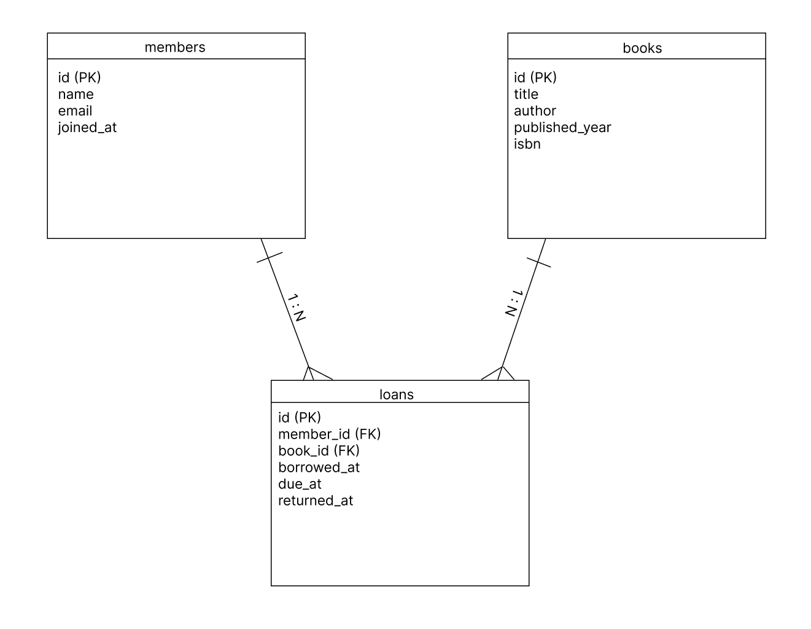
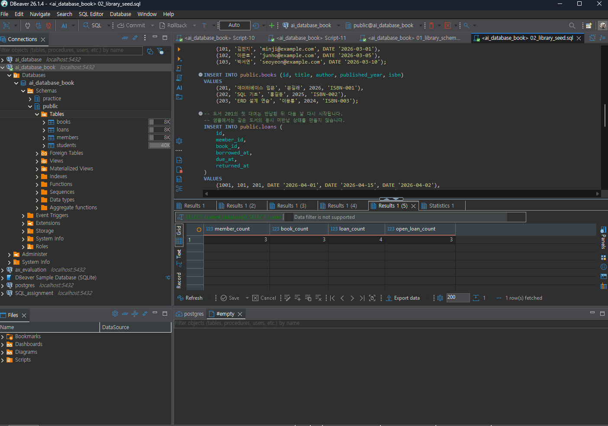
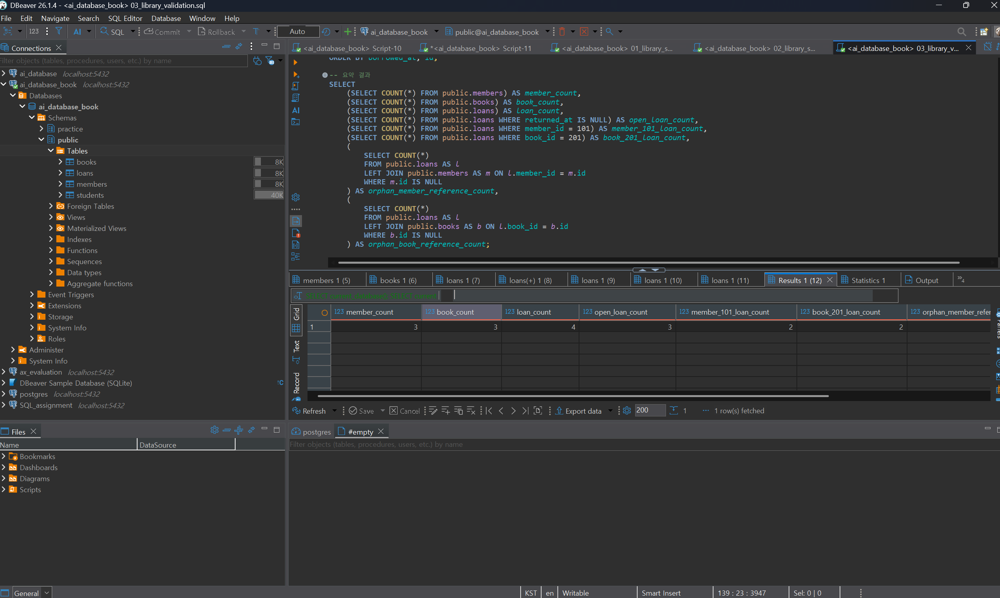
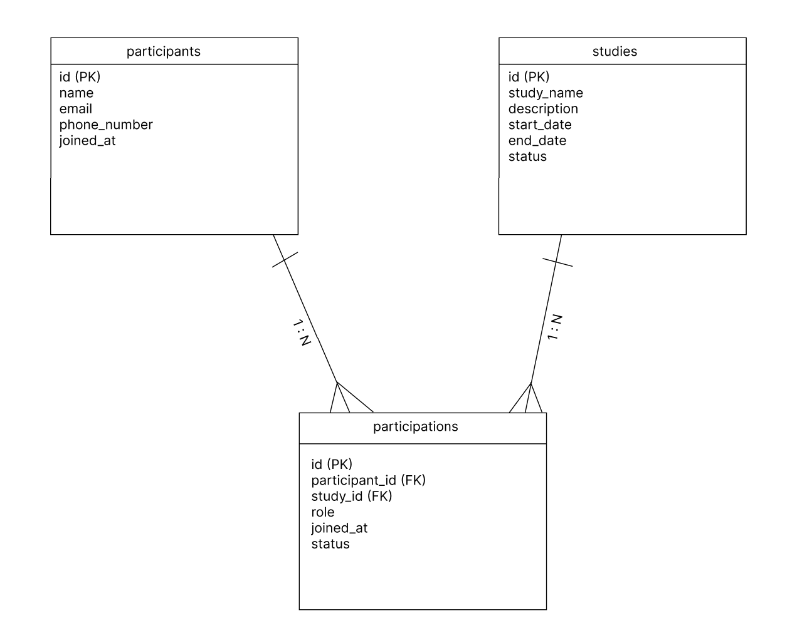

# Chapter 05 확장 실습 답안 템플릿

> **과제:** 요구사항에서 데이터 모델과 ERD 만들기  
> **사용 방법:** 이 파일을 내려받아 본인의 GitHub 저장소에 `chapter05_answer.md`라는 이름으로 저장한 뒤 실습하면서 바로 작성합니다.  
> **제출 방법:** LMS에는 파일을 직접 업로드하지 않고, **본인 GitHub 저장소의 `chapter05_answer.md` 파일 URL**을 제출합니다.

---

## 제출 전 주의

이 파일과 캡처 화면에는 실제 비밀번호, 전체 DB 접속 URL, API Key, 개인정보를 기록하지 않습니다.

```text
GitHub 계정 또는 별칭 : https://github.com/lsh0555
과제 작성일 : 2026-09-10
사용한 AI 도구 : ChatGPT
```

---

# 1. Chapter 05 핵심 개념 복습

본문을 보지 않고 먼저 작성합니다.

```text
요구사항에서 바로 테이블부터 만들면 위험한 이유 : 요구사항 분석 없이 바로 테이블을 생성하면 누락된 엔터티나 잘못된 관계 설정으로 인해 DB 및 코드를 엎어야 하는 일이 발생할 수 있기 때문이다.

한 행의 의미를 먼저 정해야 하는 이유 : 의미를 명확히 해야 컬럼 구성과 PK 설정을 바르게 할 수 있기 때문이다.

확정 요구사항과 미확정 정책을 구분해야 하는 이유 : 미확정 정책을 구조에 무리하게 반영하면 추후 정책 변경 시 DB 수정이 매우 까다로워질 수 있기 때문이다.

PK와 업무상 고유값 후보의 차이 : PK는 시스템에서 행을 유일하게 식별하기 위해 데이터베이스 차원에서 지정한 주키이며, 업무상 고유값 후보(대체키)는 주민번호·이메일처럼 현실 업무에서 고유하지만 변경 가능성이 있거나 비즈니스 의미를 가진 값이다.

N:M 관계를 그대로 두지 않고 연결 테이블을 검토하는 이유 : 관계형 데이터베이스는 두 테이블 간의 N:M 관계를 직접 표현할 수 없기 때문에 N:M 관계를 1:N, N:1로 풀어주는 매개(연결) 테이블이 필요하다.
```

---

# 2. 도서 대여 요구사항 R-01~R-07 다시 분해

| 요구사항 | 관리 대상 / 사건 | 속성 후보 | 관계 / 규칙 후보 | 미확정 질문 |
| --- | --- | --- | --- | --- |
| R-01 | 회원 | - | 회원 Entity 정의 | 탈퇴 회원도 계속 보관하는가? |
| R-02 | - | 이름, 이메일, 가입일 | 회원 속성 정의 | 이메일 중복 가입을 허용하는가? |
| R-03 | 도서 | 제목, 저자, 출판연도, ISBN | 도서 Entity 및 속성 정의 | 동일한 책을 여러 권 보유(수량 관리)하는가? |
| R-04 | 대여 (사건) | - | 회원 : 도서 = N : M 관계 | 한 번에 대여할 수 있는 최대 권수 제한이 있는가? |
| R-05 | 대여 (사건) | - | 도서 1권당 여러 대여 이력 존재 (1:N) | 연체 상태인 회원도 추가 대여가 가능한가? |
| R-06 | 대여 (사건) | 대여일, 반납예정일, 실제반납일 | 대여 Entity 속성 정의 | 반납예정일 자동 계산 기준(예: 14일)은 무엇인가? |
| R-07 | - | 실제반납일 | NULL 허용 (미반납 상태 표현) | 반납 연체 시 별도의 연체료나 패널티가 부과되는가? |

### 본문과 비교한 뒤 수정한 내용

```text
처음에 놓친 부분 : R-04, R-05를 단순히 도서와 회원의 성격으로만 생각하고, 이를 중계할 '대여(Loans)'라는 별도의 사건(Entity) 개념으로 분해하는 것을 놓쳤습니다.

처음에 잘못 분류한 부분 : R-07의 '실제반납일이 비어 있다'는 문장을 단순한 예외사항으로 보았으나, DB 설계 관점에서는 해당 컬럼의 NULL 허용 여부(Nullable) 및 대여 중/반납 완료 상태를 판단하는 핵심 규칙으로 분류해야 했습니다.

수정한 이유 : 데이터 모델링에서 행위(대여)는 그 자체로 시간 흐름에 따라 이력이 남는 '사건 엔티티'가 되며, NULL 값 존재 여부는 비즈니스 상태를 판가름하는 데이터 규칙이 되기 때문입니다.
```

---

# 3. 확정 규칙과 미확정 정책 구분

## 3-1. 확정된 규칙

```text
1. 회원과 도서를 관리한다.
2. 대여 기록은 회원과 도서를 연결한다.
3. 대여일과 반납예정일을 저장한다.
4. 실제반납일은 비어 있을 수 있다.
5. 한 회원과 한 도서는 시간에 따라 여러 대여 기록을 가질 수 있다.
```

## 3-2. 미확정 질문

최소 5개를 작성합니다.

```text
Q1. 이메일 대소문자는 같은 것으로 볼 것인가?
Q2. ISBN 없는 도서를 등록할 수 있는가?
Q3. 회원 한 명의 최대 대여 권수는?
Q4. 동시에 같은 책을 두 사람이 빌릴 수 있는가?
Q5. 회원 삭제 후 대여 이력은 유지할 것인가?
```

### 미확정 정책을 바로 `UNIQUE`, `CHECK`, 삭제 규칙으로 구현하면 위험한 이유

```text
아직 확정되지 않은 정책을 제약조건으로 구현하면 정상적인 데이터까지 제한할 수 있고, 정책 변경 시 DB 구조를 다시 수정해야 하기 때문이다.
```

---

# 4. 엔터티·속성·사건 후보 구분

| 후보 | 대상 엔터티 / 사건 엔터티 / 속성 | 판단 근거 | 독립 식별 필요? |
| --- | --- | --- | --- |
| 회원 | 대상 엔터티 | 도서를 대여 하는 사람 | 필요 |
| 도서 | 대상 엔터티 | 대여 대상이 되는 책 | 필요 |
| 대여 기록 | 사건 엔터티 | 회원이 도서를 빌린 사건을 기록 | 필요 |
| 이메일 | 속성 | 회원이 가지고 있는 정보 | 불필요 |
| ISBN | 속성 | 도서가 가지고 있는 정보 | 불필요 |
| 반납예정일 | 속성 | 대여 기록이 가지고 있는 정보 | 불필요 |

### “명사가 보이면 무조건 테이블”이 아닌 이유

```text
명사라고 해서 모두 독립적으로 관리할 필요가 없기 때문이다.
이메일, ISBN, 반납예정일처럼 다른 엔터티에 속하는 정보는 별도의 테이블이 아니라 해당 테이블의 속성(열)으로 표현할 수 있다.
```

---

# 5. 테이블별 한 행의 의미와 키 후보

| 테이블 | 한 행의 의미 | PK 후보 | 업무상 고유값 후보 | FK 후보 |
| --- | --- | --- | --- | --- |
| `members` | 도서관에 등록된 회원 1명의 정보 | `id` | `email` | 없음 |
| `books` | 도서관에 소장된 책(도서) 1권의 정보 | `id` | `isbn` | 없음 |
| `loans` | 회원이 특정 책을 대여한 1건의 대여 사건 이력 | `id` | 없음 | `member_id`, `book_id` |

### `members.email`을 지금 바로 UNIQUE라고 확정하지 않는 이유

```text
이메일은 업무상 고유한 정보가 될 수 있으나, 이메일이 없는 회원이 존재할 수 있거나 동일 이메일 재가입/소셜 로그인 등으로 중복을 허용해야 할 가능성이 있기 때문이다.
```

### `books.isbn`을 지금 바로 NOT NULL + UNIQUE라고 확정하지 않는 이유

```text
도서관에 동일한 ISBN을 가진 동일한 책이 여러 권 존재할 경우, 단순 ISBN만으로는 개별 책 실물을 구분할 수 없어 UNIQUE 제약조건을 적용하기 어렵기 때문이다.
```

---

# 6. 관계를 양방향 문장으로 작성

## 6-1. `members ↔ loans`

```text
회원 한 명은 여러 건의 대여 기록을 가질 수 있다.

대여 기록 한 건은 반드시 회원 한 명에 속한다.

카디널리티 : 1 : N (일대다)
선택성에서 확인할 점 : 회원은 대여 기록이 전혀 없을 수도 있으므로(0개 가능) 선택적(Optional) 관계이지만, 대여 기록은 반드시 주체인 회원이 존재해야 하므로 필수적(Mandatory) 관계입니다.
```

## 6-2. `books ↔ loans`

```text
도서 한 건은 여러 건의 대여 기록을 가질 수 있다.

대여 기록 한 건은 반드시 도서 한 건에 속한다.

카디널리티 : 1 : N (일대다)
선택성에서 확인할 점 : 신간이나 미대여 도서는 대여 기록이 없을 수 있어(0개 가능) 선택적(Optional) 관계이지만, 대여 기록은 대여된 대상 도서가 반드시 지정되어야 하므로 필수적(Mandatory) 관계입니다.
```

## 6-3. `members ↔ books`를 직접 N:M으로 저장하지 않고 `loans`를 두는 이유

```text
RDB에서는 테이블 간 N:M(다대다) 관계를 직접 표현할 수 없어 데이터 중복이나 조회 성능 문제가 발생하기 때문이다. 또한 회원과 도서가 만나는 순간 발생하는 중첩된 대여 이력을 누적하여 기록하려면 1:N, N:1로 연결해 주는 중간 매개 테이블이 필수적입니다.
```

### `loans`가 단순 연결표가 아니라 사건 엔터티라고 볼 수 있는 이유

```text
단순히 두 테이블의 PK만 연결하는 연결 테이블(Junction Table)과 달리, loans는 '대여일', '반납예정일', '실제반납일'처럼 대여라는 비즈니스 '사건(Event)'이 일어났을 때 새롭게 발생하는 독자적인 속성(데이터)들을 직접 가지고 관리하기 때문입니다.
```

---

# 7. 도서 대여 ERD 초안

아래 항목이 보이도록 ERD를 작성합니다.

```text
members
books
loans
PK
FK
주요 속성
1:N 관계
```

권장 이미지 경로:

```text
assignments/chapter05/images/step07_library_erd.png
```

Markdown 예시:

```markdown

```


### ERD를 그린 뒤 수정한 부분

```text

```

---

# 8. PostgreSQL로 도서 대여 모델 구현 확인

## 8-1. 현재 환경 확인

```sql
SELECT current_database();
SELECT current_user;
SELECT current_schema();
SHOW search_path;
SHOW transaction_read_only;
```

```text
현재 DB : ai_database_book
현재 사용자 : postgres
현재 스키마 : public
search_path : "$user", public
읽기 전용 여부 : off
```

- [O] 현재 DB가 `ai_database_book`이다.
- [O] 실행 범위를 확인했다.
- [O] Auto-commit 상태를 확인했다.

## 8-2. 스키마 생성 SQL 실행

사용 파일:

```text
code/chapter05/01_library_schema.sql
```

실행 전 예상:

```text
생성될 테이블 수 : 3개
생성 순서 : members → books → loans
각 테이블 예상 행 수 : 0개
```

실행 후 실제 : 

```text
members 존재 : 존재함
books 존재 : 존재함
loans 존재 : 존재함
각 테이블 행 수 : 모두 0개
```

### `loans`를 마지막에 만드는 이유

```text
loans 테이블은 members와 books 테이블의 id를 외래키로 참조하므로 members와 books 테이블이 먼저 생성되어 있어야 하기 때문이다.
```

---

# 9. 샘플 데이터 입력과 관계 관찰

사용 파일:

```text
code/chapter05/02_library_seed.sql
```

## 9-1. 실행 전 예상

```text
members 예상 행 수 : 3
books 예상 행 수 : 3
loans 예상 행 수 : 4
미반납 예상 건수 : 3
회원 101 대여 예상 건수 : 2
도서 201 대여 예상 건수 : 2
```

## 9-2. 실제 결과

```text
members 실제 행 수 : 3
books 실제 행 수 : 3
loans 실제 행 수 : 4
미반납 실제 건수 : 3
회원 101 대여 실제 건수 : 2
도서 201 대여 실제 건수 : 2
```

### 샘플 데이터에서 확인한 1:N 관계

```text
회원 1명은 여러 개의 대여 기록을 가질 수 있고, 도서 1권도 시간에 따라 여러 개의 대여 기록을 가질 수 있다.
```

### `returned_at = NULL`이 의미하는 것

```text
returned_at이 NULL이라는 것은 아직 반납일이 기록되지 않았다는 뜻이며 현재 반납되지 않은 대여 상태라고 해석할 수 있다.
```

### 증거 화면

권장 경로:

```text
assignments/chapter05/images/step09_seed_result.png
```



---

# 10. 검증 SQL 실행

사용 파일:

```text
code/chapter05/03_library_validation.sql
```

## 10-1. 결과 기록

```text
members = 3
books = 3
loans = 4
미반납 건수 = 3
회원 101 대여 이력 = 2
도서 201 대여 이력 = 2
회원 참조 고아 행 = 0
도서 참조 고아 행 = 0
loans FK 개수 = 2
검증 최종 메시지 = Chapter 05 library model validation passed
```

### 단순히 테이블 3개가 생성되었다고 설계 검증이 끝난 것이 아닌 이유

```text
테이블 생성 여부만으로는 관계와 데이터 무결성이 정상인지 알 수 없기 때문에 추가 검증이 필요하다.
```

### 증거 화면

권장 경로:

```text
assignments/chapter05/images/step10_validation.png
```



---

# 11. 작은 시나리오로 모델 검증

아래 시나리오를 현재 모델이 표현할 수 있는지 판단합니다.

| 시나리오 | 표현 가능? | 이유 | 추가 확인할 정책 |
| --- | --- | --- | --- |
| 회원 A가 서로 다른 책 2권을 대여 | 가능 | loans에 같은 member_id로 서로 다른 book_id를 여러 행 저장할 수 있다 | 회원의 최대 동시 대여 권수 |
| 같은 책을 시간 차를 두고 다시 대여 | 가능 | 같은 book_id라도 대여 시점이 다른 별도 대여 기록을 저장할 수 있다 | 이전 대여가 반납된 후 재대여 가능한지 |
| 아직 반납하지 않은 대여 | 가능 | returned_at을 NULL로 저장할 수 있다 | 연체 처리 기준 |
| 회원은 있지만 대여 기록이 없음 | 가능 | members에만 존재하고 loans에 기록이 없어도 된다 | 대여 기록이 없는 회원의 조회 방법 |
| ISBN이 없는 도서 | 가능 | books.isbn에 NOT NULL 제약조건이 없어 NULL 저장이 가능하다 | ISBN 입력을 필수로 할지 |
| 같은 ISBN의 실물 복본 2권 | 표현하기 어려움 | 현재 books에는 ISBN 하나당 실제 책 한 권을 구분하는 구조가 없다 | 실물 도서별 고유 ID를 따로 관리할지 |
| 한 도서에 저자 2명 | 표현하기 어려움 | 현재 author가 하나의 VARCHAR 열이라 여러 저자를 관계형으로 관리하기 어렵다 | 저자를 별도 테이블로 관리할지 |
| 같은 도서를 두 명이 동시에 대여 | 현재 구조상 가능 | 같은 book_id의 미반납 대여를 막는 제약조건이 없다 | 동일 도서의 동시 대여를 금지할지 |

### 현재 Chapter 05 모델의 한계 3가지

```text
1. 같은 ISBN을 가진 실물 도서 여러 권을 각각 구분하기 어렵다.
2. 한 도서에 여러 명의 저자가 있는 경우를 관계형으로 관리하기 어렵다.
3. 같은 도서를 여러 회원이 동시에 대여하는 것을 현재 구조만으로는 막을 수 없다.
```

---

# 12. Chapter 01~04 개인 서비스 요구사항 작성

지금까지 선택한 개인 서비스 아이디어를 사용합니다.

```text
서비스 이름 : 스터디 모임 관리
서비스 목적 : 스터디 모임을 관리하기 위해서
```

## 12-1. 요구사항

최소 8개를 작성합니다.

```text
P05-R01. 스터디 참여자의 이름, 이메일, 역할 정보를 저장할 수 있어야 한다.
P05-R02. 한 참여자는 여러 스터디 모임에 참여할 수 있어야 한다.
P05-R03. 하나의 스터디 모임에는 여러 참여자가 등록될 수 있어야 한다.
P05-R04. 스터디 모임의 이름, 시작일, 종료일 등의 정보를 저장할 수 있어야 한다.
P05-R05. 참여자가 스터디에 가입한 날짜를 기록할 수 있어야 한다.
P05-R06. 참여자의 스터디 참여 상태(참여 중, 탈퇴 등)를 관리할 수 있어야 한다.
P05-R07. 스터디 모임별 진행 일정과 모임 날짜를 여러 번 기록할 수 있어야 한다.
P05-R08.  각 스터디 모임에서 참여자가 맡은 역할을 기록할 수 있어야 한다.
```

> 화면 기능보다 **저장해야 할 사실, 반복 사건, 상태와 관계**를 중심으로 작성합니다.

## 12-2. 미확정 질문

최소 3개를 작성합니다.

```text
P05-Q01. 한 참여자가 여러 스터디 모임에 동시에 참여할 수 있는가?
P05-Q02. 스터디에서 탈퇴한 참여자의 기존 참여 기록은 계속 보관할 것인가?
P05-Q03. 하나의 스터디에서 참여자가 여러 역할을 동시에 맡을 수 있는가?
```

---

# 13. 개인 서비스 모델 초안

## 13-1. 엔터티·사건 후보표

| 후보 | 대상 / 사건 | 한 행의 의미 | 주요 속성 | PK 후보 | 업무 식별자 후보 |
| --- | --- | --- | --- | --- | --- |
| 참여자 | 대상 | 참여자 한 명 | 이름, 이메일 | participant_id | email |
| 스터디 | 대상 | 스터디 모임 하나 | 스터디명, 시작일, 종료일 | study_id | 스터디명 |
| 스터디 참여 | 사건 | 참여자가 스터디에 참여한 기록 한 건 | 가입일, 참여 상태, 역할 | participation_id | participant_id + study_id |
| 모임 일정 | 사건 | 스터디에서 진행하는 모임 한 회 | 모임 날짜, 회차 | meeting_id | study_id + 회차 |

## 13-2. 관계 문장

최소 3쌍을 양방향으로 작성합니다.

```text
관계 1:
A 한 건은 참여자 한 명은 여러 스터디 참여 기록을 가질 수 있다.
B 한 건은 스터디 참여 기록 한 건은 한 명의 참여자에 속한다.

관계 2:
A 한 건은 스터디 하나는 여러 스터디 참여 기록을 가질 수 있다.
B 한 건은 스터디 참여 기록 한 건은 하나의 스터디에 속한다.

관계 3:
A 한 건은 스터디 하나는 여러 모임 일정을 가질 수 있다.
B 한 건은 모임 일정 한 건은 하나의 스터디에 속한다.
```

## 13-3. N:M 관계 검토

```text
N:M 관계 후보 : 참여자 ↔ 스터디
연결 테이블 후보 : 스터디 참여(participation)
연결 테이블 한 행의 의미 : 참여자 한 명이 스터디 하나에 참여한 기록 1건
연결 테이블 자체에 필요한 사건 속성 : 가입일(joined_at), 참여 상태(status), 역할(role)
```

---

# 14. 개인 서비스 ERD 초안

ERD에 최소 다음을 표시합니다.

```text
테이블 3개 이상
각 테이블 PK
주요 속성
필요한 FK
관계선
카디널리티
```

권장 이미지 경로:

```text
assignments/chapter05/images/step14_my_erd.png
```



### ERD의 각 테이블이 어떤 요구사항에서 나왔는지 설명

| 테이블 | 근거 요구사항 ID | 한 행의 의미 |
| --- | --- | --- |
| participants | P05-R01, P05-R02, P05-R03 | 참여자 한 명 |
| studies | P05-R02, P05-R03, P05-R04 | 스터디 모임 하나 |
| participations | P05-R02, P05-R03, P05-R05, P05-R06, P05-R08 | 참여자가 스터디에 참여한 기록 한 건 |

---

# 15. 요구사항 추적표

| 요구사항 ID | 데이터 모델 반영 위치 | 검증 방법 | 상태 (반영/미반영/확인필요) |
| --- | --- | --- | --- |
| P05-R01 | participants | name, email, role 관련 컬럼 확인 | 반영 |
| P05-R02 | participations | 한 participant가 여러 participation을 가질 수 있는지 확인 | 반영 |
| P05-R03 | participations | 한 study가 여러 participation을 가질 수 있는지 확인 | 반영 |
| P05-R04 | studies | study_name, start_date, end_date 컬럼 확인 | 반영 |
| P05-R05 | participations | joined_at 컬럼 확인 | 반영 |
| P05-R06 | participations | status 컬럼 확인 | 반영 |
| P05-R07 | meetings | 하나의 study에 여러 meeting 행이 생성 가능한지 확인 | 확인필요 |
| P05-R08 | participations | role 컬럼 확인 | 반영 |

### ERD 그림만으로 요구사항 누락을 발견하기 어려운 이유

```text
ERD 그림으로 테이블들의 관계는 확인할 수 있지만 각 요구사항이 실제로 빠짐없이 반영되었는지 확인하기는 어렵기 때문이다.
```

---

# 16. 개인 서비스 작은 데이터 시나리오 검증

가상 데이터만 사용합니다.

```text
사용자/대상 A : 김민지
사용자/대상 B : 이준호
대상 X : 파이썬 스터디
대상 Y : SQL 스터디
사건 1 : 김민지가 파이썬 스터디에 참여한다.
사건 2 : 이준호가 파이썬 스터디에 참여한다.
사건 3 : 김민지가 SQL 스터디에도 참여한다.
사건 4 : 파이썬 스터디의 1회차 모임이 진행된다.
```

### 이 시나리오를 현재 ERD로 저장할 수 있는가?

```text
저장 할 수 있다.
```

### 저장하기 어려운 상황 또는 모호한 부분

```text

```

### 시나리오 검증 후 수정한 ERD 내용

```text

```

---

# 17. AI를 설계자가 아니라 리뷰어로 활용

## 17-1. AI에게 전달한 핵심 자료

```text
요구사항 :
참여자를 등록하고 여러 스터디를 생성하여 관리한다.
한 참여자는 여러 스터디에 참여할 수 있고, 하나의 스터디에도 여러 참여자가 참여할 수 있다.
스터디 참여 시 역할, 참여일, 참여 상태를 관리한다.

미확정 질문 :
스터디별 최대 참여 인원은 몇 명인가?
스터디 탈퇴 후 참여 기록을 유지할 것인가?

테이블별 한 행 의미 :
participants : 참여자 한 명에 대한 정보
studies : 스터디 하나에 대한 정보
participations : 참여자가 특정 스터디에 참여한 기록 한 건

관계 문장 :
한 참여자는 여러 스터디에 참여할 수 있다.
한 스터디에는 여러 참여자가 참여할 수 있다.
participants와 studies의 N:M 관계는 participations를 통해 연결된다.

ERD 설명 :
participants와 studies의 N:M 관계를 표현하기 위해 participations 연결 테이블을 두었다.
participations의 participant_id는 participants의 id를 참조한다.
role, joined_at, status를 통해 스터디 참여 정보를 관리한다.
 
```

## 17-2. AI 검토 요청

실제로 사용한 프롬프트 또는 핵심 내용을 기록합니다.

```text

나는 데이터베이스를 배우는 초보자입니다.
아래 요구사항과 내가 만든 데이터 모델을 검토해 주세요.
중요 : 완성된 ERD를 대신 만들어 주지 마세요.
내 설계에서 확인해야 할 질문을 먼저 제시해 주세요.
다음 관점으로 검토해 주세요.
1. 요구사항에 없는 정책을 내가 임의로 확정했는지
2. 테이블 한 행의 의미가 모호한 곳
3. 대상과 사건을 섞은 곳
4. PK와 업무 식별자를 혼동한 곳
5. N:M인데 연결 엔터티가 빠진 곳
6. FK 방향이나 카디널리티가 이상한 곳
7. 미확정 질문으로 남겨야 할 부분
8. 작은 데이터 예제로 검증하면 좋을 상황

[요구사항]
참여자를 등록하고 여러 스터디를 생성하여 관리한다.
한 참여자는 여러 스터디에 참여할 수 있고, 하나의 스터디에도 여러 참여자가 참여할 수 있다.
스터디 참여 시 역할, 참여일, 참여 상태를 관리한다.

[미확정 질문]
스터디별 최대 참여 인원은 몇 명인가?
스터디 탈퇴 후 참여 기록을 유지할 것인가?

[테이블별 한 행 의미]
participants : 참여자 한 명에 대한 정보
studies : 스터디 하나에 대한 정보
participations : 참여자가 특정 스터디에 참여한 기록 한 건

[관계 설명]
한 참여자는 여러 스터디에 참여할 수 있다.
한 스터디에는 여러 참여자가 참여할 수 있다.
participants와 studies의 N:M 관계는 participations를 통해 연결된다.

```

## 17-3. AI 제안 검토

| AI 제안 또는 질문 | 수용 / 수정 / 보류 / 거절 | 실제 근거 요구사항 | 나의 판단 이유 |
| --- | --- | --- | --- |
| 같은 참여자의 같은 스터디 중복 참여 가능 여부 확인 | 보류 | 요구사항에 중복 참여 규칙이 없음 | 아직 정해지지 않은 정책이므로 확정하지 않음 |
| participations를 N:M 연결 엔터티로 사용 | 수용 | 참여자는 여러 스터디에 참여하고 스터디에는 여러 참여자가 참여 가능 | N:M 관계를 표현하기 위해 연결 엔터티가 필요함 |
| role, joined_at, status를 participations에 저장 | 수용 | 스터디 참여 시 역할, 참여일, 참여 상태를 관리함 | 참여자 자체가 아닌 스터디 참여에 대한 정보이기 때문 |
| 이메일을 UNIQUE로 설정할지 확인 | 보류 | 이메일 중복 가능 여부가 요구사항에 없음 | 요구사항에 없는 제약조건을 임의로 추가하지 않음 |
| 스터디 최대 참여 인원 확인 | 보류 | 최대 참여 인원이 정해지지 않음 | 미확정 정책으로 남겨야 함 |

### AI가 요구사항에 없는 정책을 임의로 확정한 부분이 있었나요?

```text
AI가 같은 참여자의 같은 스터디 중복 참여 제한, 이메일 UNIQUE 등의 가능성을 제시했지만 요구사항에는 정해져 있지 않기에 해당 내용은 확정하지 않고 미확정 정책으로 남겼다.
```

### AI 검토를 받고도 채택하지 않은 제안 하나와 그 이유

```text
이메일에 UNIQUE 제약조건을 설정하는 제안은 채택하지 않았다. 현재 요구사항에는 이메일이 반드시 고유해야 한다는 규칙이 없기 때문에 임의로 제약조건을 추가하지 않았다.
```

---

# 18. 선택 — PostgreSQL DDL 초안

> 이 단계는 완성된 구현이 아니라 **현재 데이터 모델을 SQL 구조로 옮겨 보는 연습**입니다. Chapter 06에서 정규화와 제약조건을 더 엄격하게 검토합니다.

```sql
-- 개인 서비스 DDL 초안
CREATE TABLE participants (
    id INTEGER GENERATED BY DEFAULT AS IDENTITY PRIMARY KEY,
    name VARCHAR(50) NOT NULL,
    email VARCHAR(100) NOT NULL,
    phone_number VARCHAR(20),
    joined_at DATE NOT NULL
);

CREATE TABLE studies (
    id INTEGER GENERATED BY DEFAULT AS IDENTITY PRIMARY KEY,
    study_name VARCHAR(100) NOT NULL,
    description TEXT,
    start_date DATE,
    end_date DATE,
    status VARCHAR(20)
);

CREATE TABLE participations (
    id INTEGER GENERATED BY DEFAULT AS IDENTITY PRIMARY KEY,
    participant_id INTEGER NOT NULL REFERENCES participants(id),
    study_id INTEGER NOT NULL REFERENCES studies(id),
    role VARCHAR(30),
    joined_at DATE,
    status VARCHAR(20)
);
```

### 아직 구현하지 않은 미확정 정책

```text
1. 한 참여자가 동시에 참여할 수 있는 스터디의 최대 개수
2. 스터디에 참여할 수 있는 최대 인원 수
3. 스터디 탈퇴 후 참여 기록을 삭제할지 유지할지 여부
```

---

# 19. 최종 성찰

아래 문장은 반드시 본인의 말로 작성합니다.

```text
1. 요구사항에서 바로 테이블을 만들지 않고 중간 설계 과정을 거쳐야 하는 이유는
   필요한 데이터와 관계를 먼저 정리하여 잘못된 테이블 구조를 만드는 것을 줄이기 위해서이다.

2. 테이블의 한 행 의미가 중요한 이유는
   한 행이 무엇을 나타내는지 정해야 필요한 열과 기본키를 정확하게 정할 수 있기 때문이다.

3. 미확정 정책을 그대로 남겨 두는 것이 좋은 설계 활동일 수 있는 이유는
   아직 결정되지 않은 내용을 임의로 정해서 잘못된 제약조건을 만드는 것을 방지할 수 있기 때문이다.

4. N:M 관계에서 연결 엔터티가 필요한 이유는
   두 테이블의 여러 데이터를 서로 연결하고 관계에 대한 정보를 저장하기 위해서이다.

5. AI가 ERD를 만들어 주더라도 사람이 반드시 확인해야 하는 것은
   실제 요구사항과 업무 규칙이 올바르게 반영되었는지 여부이다.
```

---

# 20. 제출 체크리스트

- [O] `chapter05_answer.md`를 본인 저장소에 만들었다.
- [O] R-01~R-07을 직접 재분해했다.
- [O] 확정 규칙과 미확정 질문을 구분했다.
- [O] `members/books/loans`의 한 행 의미를 설명했다.
- [O] 관계를 양방향 문장으로 작성했다.
- [O] 도서 대여 ERD를 작성했다.
- [O] `01_library_schema.sql`을 실행했다.
- [O] `02_library_seed.sql`을 실행했다.
- [O] `03_library_validation.sql` 결과를 확인했다.
- [O] 작은 시나리오로 모델의 한계를 확인했다.
- [O] 개인 서비스 요구사항을 8개 이상 작성했다.
- [O] 개인 서비스 미확정 질문을 3개 이상 작성했다.
- [O] 개인 서비스 ERD를 작성했다.
- [O] 요구사항 추적표를 작성했다.
- [O] 개인 서비스 작은 데이터 시나리오를 검증했다.
- [O] AI 제안을 수용/수정/보류/거절로 판단했다.
- [O] 핵심 캡처 또는 ERD 이미지 3~4장 이내로 정리했다.
- [O] 이미지가 GitHub 웹 화면에서 실제로 보인다.
- [O] 답안 파일을 commit/push했다.

---

# 21. LMS 제출 URL

아래 형식의 **본인 GitHub 파일 URL**을 LMS에 제출합니다.

```text
https://github.com/<본인-GitHub-ID>/<본인-저장소>/blob/main/assignments/chapter05/chapter05_answer.md
```

내 제출 URL:

```text
https://github.com/lsh0555/ai_database/blob/main/assignments/chapter05/chapter05_answer_template.md
```

> 저장소 메인 URL, 교수자 템플릿 URL, Raw URL이 아니라 **작성 완료된 본인 `chapter05_answer.md` 파일 화면 URL**을 제출합니다.