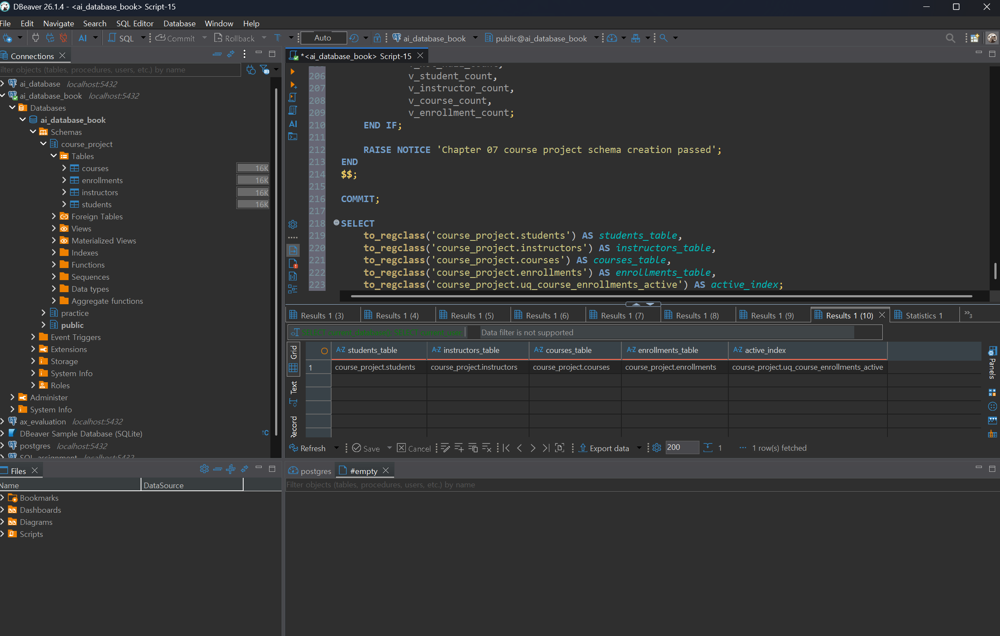
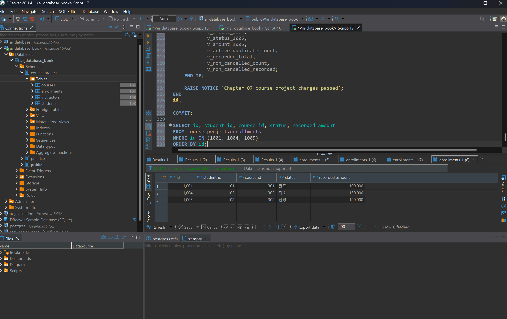
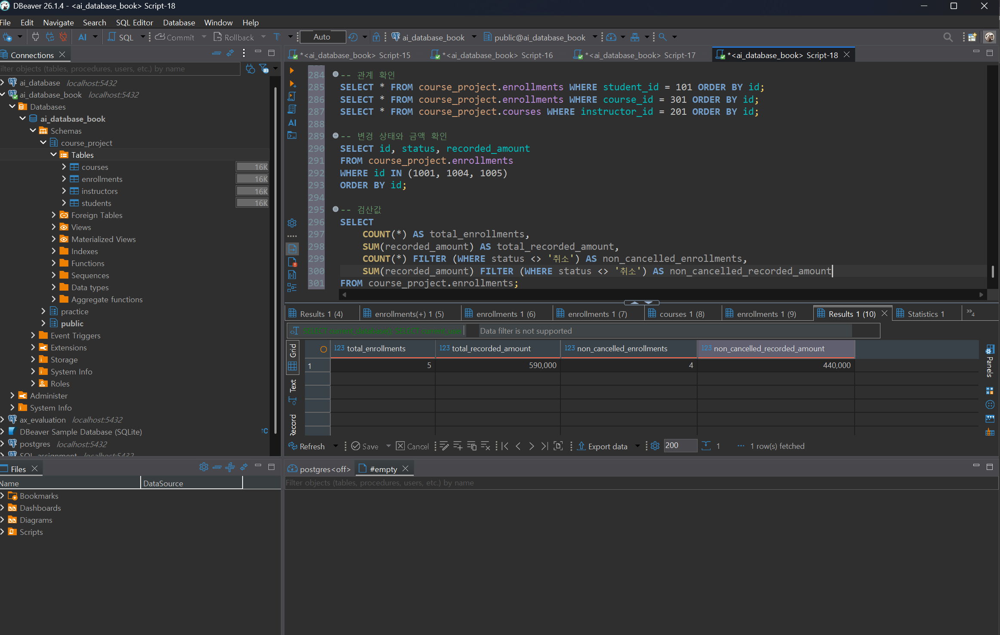
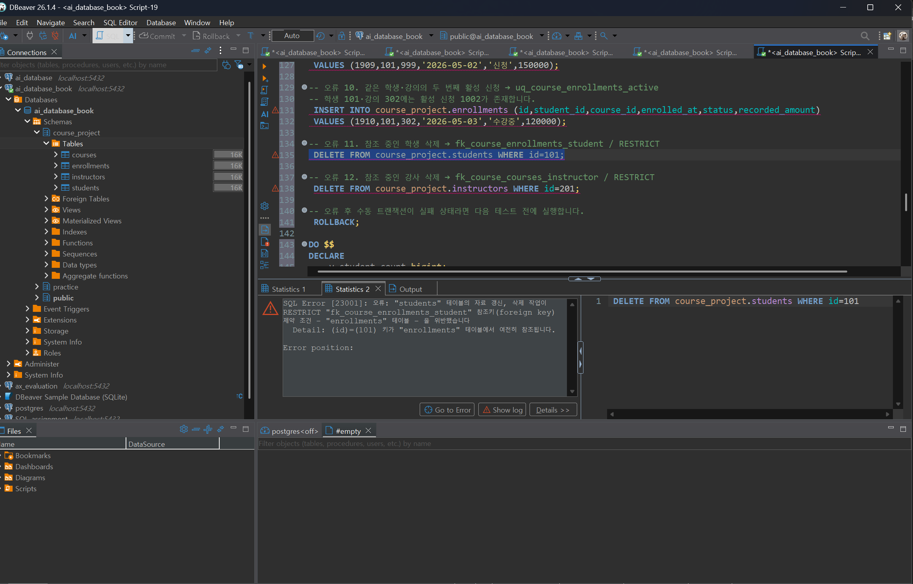
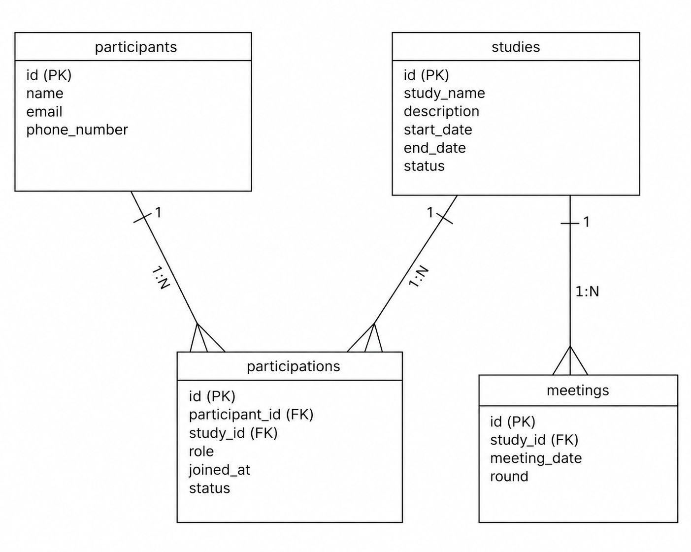

# Chapter 07 확장 실습 답안 템플릿

> **과제:** 실전 프로젝트 1 — 온라인 강의 수강신청 DB 완성하기  
> **사용 방법:** 이 파일을 내려받아 본인의 GitHub 저장소에 `chapter07_answer.md`라는 이름으로 저장한 뒤 실습하면서 바로 작성합니다.  
> **제출 방법:** LMS에는 파일을 직접 업로드하지 않고, **본인 GitHub 저장소의 `chapter07_answer.md` 파일 URL**을 제출합니다.

---

## 제출 전 주의

이 파일과 캡처 화면에는 실제 비밀번호, 전체 DB 접속 URL, API Key, 개인정보를 기록하지 않습니다.

```text
GitHub 계정 또는 별칭 : https://github.com/lsh0555
과제 작성일 : 2026-09-15
사용한 AI 도구 : ChatGPT
```

---

# 1. 시작 환경 확인

다음을 실행합니다.

```sql
SELECT current_database();
SELECT current_user;
SELECT current_schema();
SHOW search_path;
SHOW transaction_read_only;
```

| 확인 항목 | 실제 결과 | 의미 |
| --- | --- | --- |
| `current_database()` | ai_database_book | 현재 접속 중인 데이터베이스는 ai_database_book이다. |
| `current_user` | postgres | 현재 DB에 접속한 사용자는 postgres이다. |
| `current_schema()` | public | 현재 기본으로 사용되는 스키마는 public이다. |
| `search_path` | "$user", public | 객체를 찾을 때 사용자 이름과 같은 스키마를 먼저 찾고, 그다음 public 스키마를 찾는다. |
| `transaction_read_only` | off | 현재 트랜잭션이 읽기 전용 상태가 아니다. |

- [O] 현재 DB가 `ai_database_book`이다.
- [O] 쓰기 가능한 연결인지 확인했다.
- [O] 실행할 SQL 범위를 확인했다.
- [O] Auto-commit 상태를 확인했다.

### 프로젝트 SQL을 실행하기 전에 시작 상태를 확인해야 하는 이유

```text
기존 테이블이나 데이터가 남아 있으면 프로젝트 SQL 실행 결과에 영향을 줄 수 있고 이전 데이터 때문에 제약조건 추가나 테스트 결과가 달라질 수 있기 때문이다. 시작 상태를 먼저 확인하면 프로젝트 SQL 실행 전후의 변화를 정확하게 비교하고 검증할 수 있다.
```

---

# 2. 프로젝트 범위와 요구사항 읽기

## 2-1. 포함 범위

본문을 그대로 복사하지 말고 자신의 말로 정리합니다.

```text
1. 정규화 전 큰 테이블의 문제점을 찾고 삽입·수정·삭제 이상을 설명한다.
2. 1NF, 2NF, 3NF의 기준을 이용하여 데이터 구조를 분석한다.
3. 회원, 도서, 대여 정보를 적절한 테이블로 분리하고 무결성 제약조건을 적용한다.
4. 정상·경계·실패 데이터를 직접 실행하여 제약조건이 업무 규칙을 올바르게 보호하는지 검증한다.
```

## 2-2. 제외 범위

```text
1. 웹 화면이나 사용자 인터페이스(UI) 구현은 진행하지 않는다.
2. 로그인, 회원가입과 같은 인증 기능은 구현하지 않는다.
3. 실제 서비스 배포나 서버 운영은 진행하지 않는다.
4. 이번 프로젝트에서 요구하지 않는 추가 기능이나 복잡한 업무 기능은 구현하지 않는다.
```

### 범위를 명확하게 정해야 하는 이유

```text
범위가 명확하지 않으면 필요하지 않은 기능까지 구현하거나 반대로 반드시 구현해야 하는 요구사항을 놓칠 수 있다.
프로젝트 시작 전에 범위를 정하여 개발 기준을 명확하게 하고 불필요한 작업을 줄여야 한다.
```

## 2-3. 요구사항 / 프로젝트 결정 / 미확정 질문 구분

아래 항목 중 대표 항목을 정리합니다.

| ID | 종류 | 내용 요약 | DB 구조/규칙에 미치는 영향 |
| --- | --- | --- | --- |
| P07-R01 | 요구사항 | 원문 확인 후 작성 | 해당 요구사항에 따라 테이블/제약조건 결정 |
| P07-R05 | 요구사항 | 원문 확인 후 작성 | 해당 요구사항에 따라 테이블/제약조건 결정 |
| P07-R07 | 요구사항 | 원문 확인 후 작성 | 해당 요구사항에 따라 테이블/제약조건 결정 |
| P07-D02 | 프로젝트 결정 | 원문 확인 후 작성 | 결정된 정책을 DB 구조 또는 제약조건에 반영 |
| P07-D03 | 프로젝트 결정 | 원문 확인 후 작성 | 결정된 정책을 DB 구조 또는 제약조건에 반영 |
| P07-Q01 | 미확정 질문 | 원문 확인 후 작성 | 답변이 확정된 후 DB 규칙 적용 여부 결정 |

### 미확정 질문을 바로 제약조건으로 만들면 안 되는 이유

```text
확정되지 않은 내용을 제약조건으로 구현하면 실제 요구사항과 다른 데이터까지 차단할 수 있고 이후 정책이 변경되면 데이터베이스 구조나 제약조건을 다시 수정해야 할 수 있기 때문이다.
```

---

# 3. 네 테이블의 한 행 의미와 관계

## 3-1. 한 행 의미

```text
course_project.students 한 행 = 학생 한 명의 정보를 의미한다.

course_project.instructors 한 행 = 강사 한 명의 정보를 의미한다.

course_project.courses 한 행 = 개설된 강의 한 개의 정보를 의미한다.

course_project.enrollments 한 행 = 특정 학생이 특정 강의를 수강하는 관계 한 건을 의미한다.
```

## 3-2. 키와 중요 규칙

| 테이블 | PK | FK | 중요 규칙 |
| --- | --- | --- | --- |
| students | id | 없음 | 학생 한 명을 고유하게 식별해야 한다. |
| instructors | id | 없음 | 강사 한 명을 고유하게 식별해야 한다. |
| courses | id | instructor_id → instructors.id | 각 강의는 존재하는 강사와 연결되어야 한다. |
| enrollments | id | student_id → students.id, course_id → courses.id | 존재하는 학생과 강의만 연결할 수 있으며 동일한 학생의 동일 강의 중복 수강은 방지해야 한다. |

## 3-3. 관계를 양방향 문장으로 작성

```text
instructors ↔ courses : 한 명의 강사는 여러 강의를 담당할 수 있고, 각 강의는 한 명의 강사와 연결된다.

students ↔ enrollments : 한 명의 학생은 여러 수강 기록을 가질 수 있고, 각 수강 기록은 한 명의 학생과 연결된다.

courses ↔ enrollments : 하나의 강의는 여러 수강 기록을 가질 수 있고, 각 수강 기록은 하나의 강의와 연결된다.
```

### 학생과 강의의 N:M 관계가 `enrollments`를 통해 어떻게 바뀌는지 설명

```text
N:M 관계를 직접 연결 할 수 없기 때문에 enrollments 테이블을 중간에 두어 students와 enrollments의 관계와 courses와 enrollments의 관계를 각각 1:N 관계로 연결해줍니다.
```

### `enrollments`가 단순 연결 테이블이 아니라 사건 테이블이라고 볼 수 있는 이유

```text
enrollments는 단순히 학생과 강의를 연결하는 역할만 하는 것이 아니라 특정 학생이 특정 강의를 수강 신청한 하나의 사건을 기록하는 테이블이기 때문이다.
```

---

# 4. `recorded_amount`의 의미 이해

```text
courses.price = 현재 강의에 설정되어 있는 수강 가격

enrollments.recorded_amount = 학생이 수강 신청한 사건 당시 실제로 기록된 금액
```

### 두 값이 처음에는 같아도 같은 의미가 아닌 이유

```text
courses.price는 현재 강의에 설정되어 있는 가격이고,
enrollments.recorded_amount는 학생이 수강 신청한 당시의 금액을 기록한 값이다.

수강 신청 시점에는 두 값이 같을 수 있지만,
나중에 강의 가격이 변경되면 courses.price는 변경되는 반면
recorded_amount는 과거 수강 당시의 금액을 보존하므로 서로 다른 의미를 가진다.
```

### `recorded_amount`를 실제 결제 성공액이나 회계 매출로 해석하면 안 되는 이유

```text
recorded_amount는 수강 신청 사건 당시의 금액을 기록한 값일 뿐 실제로 결제가 성공했다는 사실을 의미하지 않기 때문이다.
```

---

# 5. STEP 01 — 스키마와 테이블 생성

실행 파일:

```text
code/chapter07/01_course_project_schema.sql
```

## 5-1. 실행 전 예상

```text
course_project 스키마 존재 여부 : 없음
예상 테이블 수 : 4개
예상 데이터 행 수 : 0행
예상되는 명명 제약조건 수 : 15개
예상되는 NOT NULL 열 수 : 20개
부분 고유 인덱스 존재 여부 : 있음
```

## 5-2. 실행 결과

```text
실제 테이블 수 : 4개
실제 명명 제약조건 수 : 15개
실제 NOT NULL 열 수 : 20개
부분 고유 인덱스 : uq_course_enrollments_active
네 테이블의 실제 행 수 : students 0행 / instructors 0행 / courses 0행 / enrollments 0행
통과 메시지 : Chapter 07 course project schema creation passed
```

### 예상과 실제 비교

```text
실행 전에 예상한 결과와 실제 실행 결과가 일치했다.
```

### 증거 화면

권장 경로:

```text
assignments/chapter07/images/step05_schema.png
```

`여기에 스키마/테이블 생성 검증 화면을 삽입하세요.`

---

# 6. STEP 02 — Seed 데이터 입력

실행 파일:

```text
code/chapter07/02_course_project_seed.sql
```

## 6-1. 실행 전 예상

```text
students:
instructors:
courses:
enrollments:
recorded_amount 합계:
학생 101 신청 건수:
강의 301 신청 건수:
강사 201 담당 강의 수:
활성 중복 신청:
```

## 6-2. 실제 결과

```text
students:
instructors:
courses:
enrollments:
recorded_amount 합계:
학생 101 신청 건수:
강의 301 신청 건수:
강사 201 담당 강의 수:
활성 중복 신청:
1001 상태:
1004 상태:
1005 존재 여부:
통과 메시지:
```

### Seed 데이터를 단순 예제가 아니라 검증 데이터라고 볼 수 있는 이유

```text

```

---

# 7. STEP 03 — 변경 시나리오 실행

실행 파일:

```text
code/chapter07/03_course_project_changes.sql
```

## 7-1. 실행 전에 상태 변화를 예상

| 신청 ID | 변경 전 예상 상태 | 변경 후 예상 상태 | 예상 recorded_amount |
| ---: | --- | --- | ---: |
| 1001 |  |  |  |
| 1004 |  |  |  |
| 1005 |  |  |  |

```text
변경 후 예상 enrollments 행 수:
변경 후 예상 전체 recorded_amount 합계:
변경 후 예상 취소 제외 건수:
변경 후 예상 취소 제외 recorded_amount 합계:
```

## 7-2. 실제 결과

```text
1001 상태 / recorded_amount:
1004 상태 / recorded_amount:
1005 상태 / recorded_amount:
최종 enrollments 행 수:
전체 recorded_amount 합계:
취소 제외 건수:
취소 제외 recorded_amount 합계:
활성 중복 신청:
통과 메시지:
```

### 조건부 UPDATE에서 예상 이전 상태를 확인해야 하는 이유

```text

```

### 증거 화면

권장 경로:

```text
assignments/chapter07/images/step07_changes.png
```

`여기에 주요 변경 전/후 결과를 삽입하세요.`


---

# 8. STEP 04 — 최종 완료 게이트 실행

실행 파일:

```text
code/chapter07/04_course_project_validation.sql
```

## 8-1. 최종 검증 결과

```text
최종 행 수 students/instructors/courses/enrollments:
서비스 JOIN 결과 행 수:
학생 101 신청 수:
강의 301 신청 수:
강사 201 강의 수:
고아 관계 수:
활성 중복 신청 수:
전체 recorded_amount:
취소 제외 recorded_amount:
통과 메시지:
```

### SQL 파일 4개가 모두 실행되었다는 사실과 프로젝트 검증 PASS가 다른 이유

```text

```

### 증거 화면

권장 경로:

```text
assignments/chapter07/images/step08_validation.png
```

`여기에 최종 validation PASS 화면을 삽입하세요.`


---

# 9. 무결성 테스트

실행 파일:

```text
code/chapter07/05_course_project_integrity_tests.sql
```

> 오류 테스트는 파일 전체를 무작정 실행하지 않고 **한 테스트 구간씩** 실행합니다.

## 9-1. 허용되어야 하는 경계값 1개

```text
테스트 내용:
기대 결과:
실제 결과:
왜 허용되어야 하는가:
```

## 9-2. 실패해야 하는 테스트 1 — 잘못된 참조 또는 값

```text
테스트 내용:
기대 결과:
실제 오류 핵심:
동작한 제약조건/규칙:
왜 실패해야 하는가:
```

## 9-3. 실패해야 하는 테스트 2 — 활성 중복 신청

```text
테스트 내용:
기대 결과:
실제 오류 핵심:
동작한 인덱스/규칙:
왜 실패해야 하는가:
```

## 9-4. 실패 후 기준 상태 재검증

```text
04 validation 재실행 결과:
기준 데이터가 유지되었는가:
```

### 실패 테스트가 프로젝트 품질 검증에 필요한 이유

```text

```

### 증거 화면

권장 경로:

```text
assignments/chapter07/images/step09_integrity.png
```

`여기에 대표 실패 테스트와 기준 상태 유지 결과를 삽입하세요.`


---

# 10. 재현성 실험

> 이 단계는 본인의 실습 환경이며 보존할 데이터가 없을 때만 수행합니다.

실행 순서:

```text
reset_course_project.sql
→ 01_course_project_schema.sql
→ 02_course_project_seed.sql
→ 03_course_project_changes.sql
→ 04_course_project_validation.sql
```

```text
처음 실행의 최종 결과:
재실행의 최종 결과:
두 결과가 일치했는가:
중간에 수동 수정이 필요했는가:
```

### 다른 사람이 같은 순서로 실행해 같은 결과를 얻는 것이 중요한 이유

```text

```

---

# 11. Chapter 01~06 개인 프로젝트를 중간 프로젝트 초안으로 확장

온라인 강의 예제를 이름만 바꾸지 않고 본인의 아이디어를 사용합니다.

## 11-1. 프로젝트 기본 정보

```text
프로젝트 이름:

해결하려는 문제:

주요 사용자:
```

## 11-2. 포함 범위 / 제외 범위

```text
[포함]
1.
2.
3.
4.

[제외]
1.
2.
3.
```

## 11-3. 요구사항

최소 8개를 작성합니다.

| ID | 요구사항 | 관련 테이블/관계 | 검증 방법 후보 |
| --- | --- | --- | --- |
| P07-MR01 |  |  |  |
| P07-MR02 |  |  |  |
| P07-MR03 |  |  |  |
| P07-MR04 |  |  |  |
| P07-MR05 |  |  |  |
| P07-MR06 |  |  |  |
| P07-MR07 |  |  |  |
| P07-MR08 |  |  |  |

## 11-4. 프로젝트 결정

최소 3개를 작성합니다.

| ID | 이번 프로젝트에서 내린 결정 | 이유 | 구현 후보 |
| --- | --- | --- | --- |
| P07-MD01 |  |  |  |
| P07-MD02 |  |  |  |
| P07-MD03 |  |  |  |

## 11-5. 미확정 질문

최소 3개를 작성합니다.

```text
P07-MQ01.
P07-MQ02.
P07-MQ03.
```

---

# 12. 개인 프로젝트 ERD와 한 행 의미

## 12-1. 테이블 후보

최소 4개를 권장합니다.

| 테이블 | 한 행의 의미 | PK 후보 | FK 후보 | 주요 규칙 |
| --- | --- | --- | --- | --- |
|  |  |  |  |  |
|  |  |  |  |  |
|  |  |  |  |  |
|  |  |  |  |  |

## 12-2. 관계 문장

```text
1.
2.
3.
```

## 12-3. ERD

권장 이미지 경로:

```text
assignments/chapter07/images/personal_project_erd.png
```

`여기에 본인의 ERD 이미지를 삽입하세요.`


### Chapter 05~06 ERD에서 이번에 바꾼 점

```text

```

---

# 13. 개인 프로젝트 완료 기준 만들기

“잘 동작한다”처럼 모호하게 쓰지 말고 검증 가능한 기준을 최소 6개 작성합니다.

| 번호 | 완료 기준 | 자동 SQL 검증 가능? | 검증 방법 |
| ---: | --- | --- | --- |
| 1 |  |  |  |
| 2 |  |  |  |
| 3 |  |  |  |
| 4 |  |  |  |
| 5 |  |  |  |
| 6 |  |  |  |

예시 형식:

```text
Seed 실행 후 A/B/C/D 테이블의 행 수가 각각 5/3/8/12다.
존재하지 않는 부모를 참조하는 행은 0건이다.
허용되지 않은 상태 입력은 DB가 거부한다.
검증 SQL이 예상 결과를 반환한다.
```

---

# 14. AI를 프로젝트 리뷰어로 사용

AI에게 프로젝트를 대신 완성시키지 않고 누락과 위험을 찾게 합니다.

## 14-1. AI에게 전달한 핵심 자료

```text
요구사항:

테이블/ERD 설명:

프로젝트 결정:

미확정 질문:

완료 기준:
```

## 14-2. 내가 사용한 프롬프트

```text

```

## 14-3. AI 제안 검토

| AI 제안 | 수용 / 수정 / 보류 / 거절 | 실제 근거 | 반영 내용 |
| --- | --- | --- | --- |
|  |  |  |  |
|  |  |  |  |
|  |  |  |  |
|  |  |  |  |

### AI가 미확정 정책을 임의로 확정하려 한 부분이 있었나요?

```text

```

### AI가 제안한 규칙 중 아직 배우지 않은 기능이라 보류한 것이 있나요?

```text

```

### AI 활용 후 실제로 좋아진 부분

```text

```

---

# 15. 최종 성찰

아래 문장은 반드시 본인의 말로 작성합니다.

```text
1. 데이터베이스 프로젝트가 완료되었다고 판단하려면
   SQL 파일의 존재보다 ________________________________________ 이 중요하다.

2. Seed 데이터의 목적은 단순히 화면을 채우는 것이 아니라
   ____________________________________________________________ 이다.

3. 실패 테스트가 필요한 이유는
   ____________________________________________________________ 이다.

4. 요구사항과 프로젝트 결정을 구분해야 하는 이유는
   ____________________________________________________________ 이다.

5. 내가 만든 개인 프로젝트에서 가장 먼저 추가 확인해야 할 정책은
   ____________________________________________________________ 이다.
```

---

# 16. 제출 체크리스트

- [O] `chapter07_answer.md`를 본인 저장소에 만들었다.
- [O] 시작 환경과 현재 DB를 확인했다.
- [O] 프로젝트 포함/제외 범위를 설명했다.
- [O] 요구사항/결정/미확정 질문을 구분했다.
- [O] 네 테이블의 한 행 의미와 관계를 설명했다.
- [O] `01_course_project_schema.sql`을 실행하고 결과를 확인했다.
- [O] `02_course_project_seed.sql`의 기준 상태를 확인했다.
- [O] `03_course_project_changes.sql` 전후 상태를 비교했다.
- [O] `04_course_project_validation.sql` PASS를 확인했다.
- [O] 허용 경계값 1개 이상을 확인했다.
- [O] 실패 테스트 2개 이상을 한 구간씩 실행했다.
- [O] 실패 후 validation을 다시 실행했다.
- [O] 개인 프로젝트 요구사항 8개 이상을 작성했다.
- [O] 프로젝트 결정 3개 이상과 미확정 질문 3개 이상을 작성했다.
- [O] 개인 프로젝트 ERD를 작성했다.
- [O] 검증 가능한 완료 기준 6개 이상을 작성했다.
- [O] AI 제안을 수용/수정/보류/거절로 구분했다.
- [O] 핵심 캡처는 3~4장 정도로 정리했다.
- [O] 캡처에 비밀번호나 개인정보가 없다.
- [O] GitHub 웹에서 Markdown과 이미지가 정상적으로 보인다.
- [O] 최종 파일을 commit/push했다.

---

# 17. LMS 제출 URL

아래 형식의 **본인 GitHub 파일 URL**을 LMS에 제출합니다.

```text
https://github.com/<본인-GitHub-ID>/<본인-저장소>/blob/main/assignments/chapter07/chapter07_answer.md
```

내 제출 URL:

```text
https://github.com/lsh0555/ai_database/blob/main/assignments/chapter07/images/chapter07_answer_template.md
```

> 저장소 메인 URL, 교수자 템플릿 URL, Raw URL이 아니라 **작성 완료된 본인 `chapter07_answer.md` 파일 화면 URL**을 제출합니다.