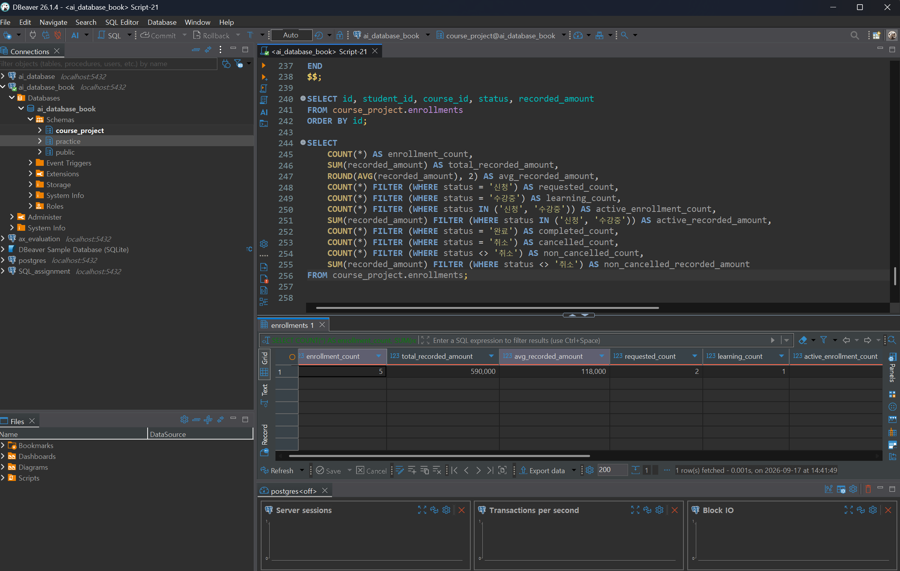
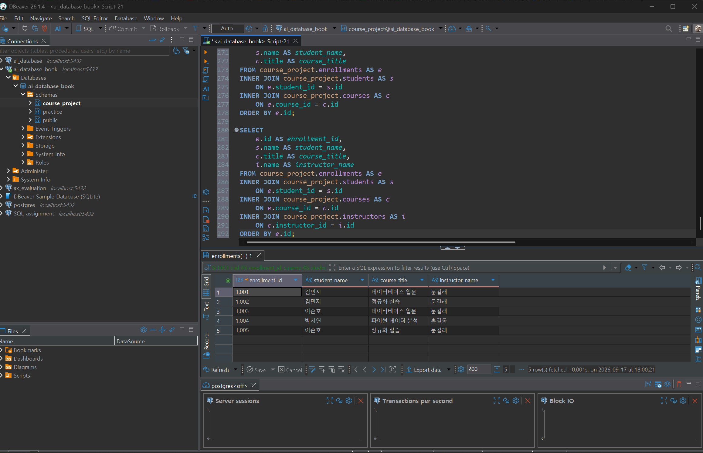
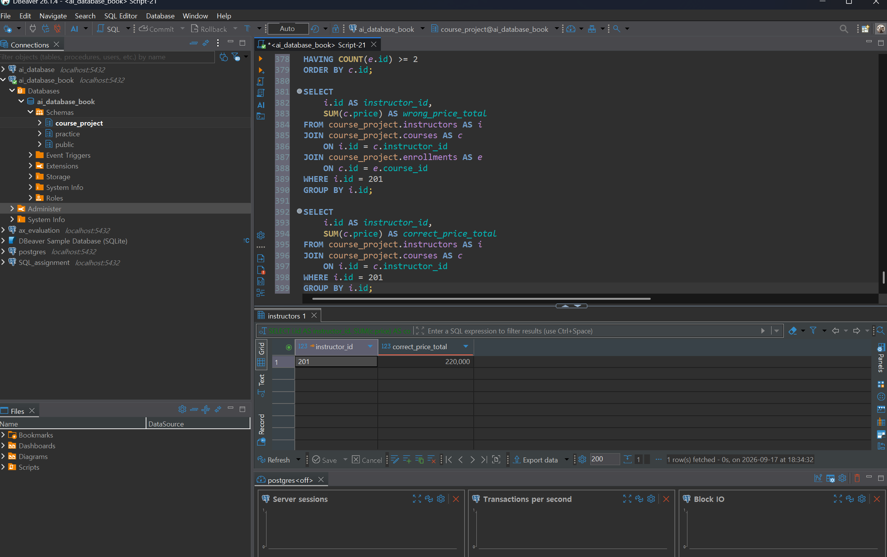

# Chapter 08 확장 실습 답안 템플릿

> **과제:** JOIN과 집계로 서비스 질문에 답하기  
> **사용 방법:** 이 파일을 내려받아 본인의 GitHub 저장소에 `chapter08_answer.md`라는 이름으로 저장한 뒤 실습하면서 바로 작성합니다.  
> **제출 방법:** LMS에는 파일을 직접 업로드하지 않고, **본인 GitHub 저장소의 `chapter08_answer.md` 파일 URL**을 제출합니다.

---

## 제출 전 주의

이 파일과 캡처 화면에는 실제 비밀번호, 전체 DB 접속 URL, API Key, 개인정보를 기록하지 않습니다.

```text
GitHub 계정 또는 별칭 : https://github.com/lsh0555
과제 작성일 : 2026-09-17
사용한 AI 도구 : ChatGPT
```

---

# 1. Chapter 07 기준 상태 확인

다음을 실행합니다.

```text
code/chapter08/00_check_course_project.sql
```

## 1-1. 사전 검사 결과

```text
검증 메시지 : 모든 기준값 일치 (PASS)

students 행 수 : 3행
instructors 행 수 : 2행
courses 행 수 : 3행
enrollments 행 수 : 5행

전체 신청 건수 : 5건
전체 recorded_amount : 590000
활성 신청 건수 : 3건
활성 recorded_amount : 340000
취소 제외 신청 건수 : 4건
취소 제외 recorded_amount : 440000
```

기준값:

```text
students = 3
instructors = 2
courses = 3
enrollments = 5

전체 = 5 / 590000
활성 = 3 / 340000
취소 제외 = 4 / 440000
```

### 기준값이 다르면 그대로 진행하면 안 되는 이유

```text
기준 데이터가 달라지면 이후 JOIN과 집계 결과도 달라져 정상 결과인지 검증하기 어렵기 때문이다.
```

### 증거 화면

권장 경로:

```text
assignments/chapter08/images/step01_prerequisite.png
```



---

# 2. 업무 질문을 SQL보다 먼저 정의하기

다음 세 질문을 각각 SQL 작성 전에 먼저 정의합니다.

## 질문 A

```text
업무 질문 : 학생별 신청한 과정과 현재 신청 상태를 확인한다.
결과 한 행의 의미 : 학생의 과정 신청 1건
포함 상태 : 신청, 수강중, 완료, 취소
제외 상태 : 없음
JOIN할 테이블 : students, enrollments, courses
JOIN 경로 : 
students.id → enrollments.student_id
enrollments.course_id → courses.id

INNER JOIN / LEFT JOIN 선택 : INNER JOIN
그 이유 : 실제로 존재하는 신청 기록을 기준으로 학생 정보와 과정 정보를 연결해서 확인하기 때문이다.
예상 행 수 : 5행
```

## 질문 B

```text
업무 질문 : 과정별 신청 및 수강중인 학생 수와 기록 금액 합계는 얼마인가?
결과 한 행의 의미 : 과정 1개
포함 상태 : 신청, 수강중
제외 상태 : 완료, 취소
JOIN할 테이블 : courses, enrollments
JOIN 경로 : courses.id → enrollments.course_id
집계 대상 : 과정별 신청·수강중 건수와 recorded_amount 합계
예상 결과 : 
데이터베이스 입문 : 1건 / 100,000원
정규화 실습 : 2건 / 240,000원
파이썬 데이터 분석 : 0건
```

## 질문 C

```text
업무 질문 : 신청 또는 수강중인 학생이 없는 과정도 함께 확인할 것인가?
결과 한 행의 의미 : 과정 1개
포함 상태 : 모든 과정
제외 상태 : 없음
0건인 부모도 보여야 하는가 : 보여야 한다.
NULL을 어떻게 해석할 것인가 : 해당 과정에 조건에 맞는 신청 또는 수강중 기록이 없다는 의미로 해석한다.
예상 결과 : 전체 3개 과정이 모두 조회되어야 하며 신청 또는 수강중인 학생이 없는 과정도 0건으로 확인할 수 있어야 한다.
```

---

# 3. INNER JOIN과 다중 JOIN

## 3-1. 신청 한 건마다 학생 이름과 강의 제목 조회

실행 전 예상:

```text
결과 한 행 = 신청 기록 1건에 해당하는 학생 이름과 강의 제목
예상 행 수 = 5행
JOIN 경로 = enrollments → students, enrollments → courses
```

내가 실행한 SQL:

```sql
SELECT
    e.id AS enrollment_id,
    s.name AS student_name,
    c.title AS course_title
FROM course_project.enrollments AS e
INNER JOIN course_project.students AS s
    ON e.student_id = s.id
INNER JOIN course_project.courses AS c
    ON e.course_id = c.id
ORDER BY e.id;
```

실제 결과:

```text
실제 행 수 : 5행
예상과 일치 여부 : 일치
```

### 학생 이름이 여러 번 보이는 것이 중복 오류가 아닐 수 있는 이유

```text
한 학생이 여러 강의를 신청할 수 있기 때문에 학생 이름이 여러 번 나타날 수 있고, 각 행이 서로 다른 신청 기록을 의미한다면 중복 오류가 아니다.
```

## 3-2. 학생·강의·강사까지 연결

```text
결과 한 행 = 학생의 강의 신청 1건과 해당 강의를 담당하는 강사 정보
강사까지 가는 JOIN 경로 = enrollments → courses → instructors
```

```sql
SELECT
    e.id AS enrollment_id,
    s.name AS student_name,
    c.title AS course_title,
    i.name AS instructor_name
FROM course_project.enrollments AS e
INNER JOIN course_project.students AS s
    ON e.student_id = s.id
INNER JOIN course_project.courses AS c
    ON e.course_id = c.id
INNER JOIN course_project.instructors AS i
    ON c.instructor_id = i.id
ORDER BY e.id;
```

실제 행 수:

```text
5행
```

### 증거 화면

권장 경로:

```text
assignments/chapter08/images/step03_inner_join.png
```



---

# 4. LEFT JOIN과 0건 표현

## 4-1. 강의별 취소 제외 신청 수

신청이 없는 강의도 결과에 남도록 작성합니다.

실행 전:

```text
결과 한 행 = 강의 한 개
강의 303의 예상 실제 신청 수 = 0건
강의 303의 예상 고유 학생 수 = 1명
강의 303의 예상 recorded_amount = 0원
```

내 SQL:

```sql
SELECT
    c.id AS course_id,
    c.title,
    COUNT(*) AS fixed_student_count,
    COUNT(e.id) AS actual_enrollment_count,
    COALESCE(SUM(e.recorded_amount), 0) AS total_recorded_amount
FROM course_project.courses AS c
LEFT JOIN course_project.enrollments AS e
    ON c.id = e.course_id
    AND e.status <> '취소'
GROUP BY c.id, c.title
ORDER BY c.id;
```

실제 결과:

```text
강의 301 : 실제 신청 수 2건 / 고정 학생 수 2 / recorded_amount 200000
강의 302 : 실제 신청 수 2건 / 고정 학생 수 2 / recorded_amount 240000
강의 303 : 실제 신청 수 0건 / 고정 학생 수 1 / recorded_amount 0
```

## 4-2. `COUNT(*)`와 `COUNT(e.id)` 비교

강의 303을 기준으로 작성합니다.

```text
COUNT(*) 결과 : 1
COUNT(e.id) 결과 : 0
COUNT(DISTINCT e.student_id) 결과 : 0
```

### 왜 `COUNT(*) = 1`인데 실제 신청 수는 0일 수 있나요?

```text
LEFT JOIN은 조건에 맞는 신청 기록이 없어도 부모 테이블인 courses의 강의 행을 남긴다.
따라서 강의 303은 결과에 1행이 남아 COUNT(*)는 1이지만 연결된 신청 정보의 e.id는 NULL이므로 실제 신청 수는 0이다.
```

### 자식 사건 수를 셀 때 `COUNT(child.id)`가 더 적절한 이유

```text
COUNT(*)는 LEFT JOIN으로 남은 부모 행까지 세지만 COUNT(child.id)는 실제로 연결된 자식 데이터의 id가 있는 경우만 세기 때문이다.
```

---

# 5. `LEFT JOIN`에서 `ON`과 `WHERE` 조건 비교

취소 제외 신청만 연결한다고 가정합니다.

## 5-1. 조건을 `ON`에 둔 경우

```sql
SELECT
    s.id AS student_id,
    s.name AS student_name,
    COUNT(e.id) AS enrollment_count
FROM course_project.students AS s
LEFT JOIN course_project.enrollments AS e
    ON s.id = e.student_id
    AND e.status <> '취소'
GROUP BY s.id, s.name
ORDER BY s.id;
```

```text
결과 학생 수 : 3명
박서연 포함 여부 : 포함
```

## 5-2. 조건을 `WHERE`에 둔 경우

```sql
SELECT
    s.id AS student_id,
    s.name AS student_name,
    COUNT(e.id) AS enrollment_count
FROM course_project.students AS s
LEFT JOIN course_project.enrollments AS e
    ON s.id = e.student_id
WHERE e.status <> '취소'
GROUP BY s.id, s.name
ORDER BY s.id;
```

```text
결과 학생 수 : 2명
박서연 포함 여부 : 미포함
```

## 5-3. 차이 설명

```text
ON 조건이 LEFT JOIN의 오른쪽 연결 대상을 제한하는 방식 : 취소 상태의 신청은 연결하지 않지만 왼쪽 테이블의 학생 행은 유지한다.

WHERE 조건이 JOIN 이후 결과 행을 제거하는 방식 : JOIN이 끝난 결과에서 취소 상태인 행을 제거하므로, 취소 신청만 있는 학생도 결과에서 사라질 수 있다.

이번 사례에서 ON = 3명, WHERE = 2명이 되는 이유 : 조건을 ON에 두면 취소 신청은 연결되지 않아도 박서연 자체는 LEFT JOIN에 의해 남고, WHERE에 두면 취소 상태인 박서연의 취소 신청 행이 조건을 만족하지 않아 결과에서 제거되기 때문이다.
```

---

# 6. 신청이 없는 학생 찾기 — 두 방법 비교

## 방법 1. `LEFT JOIN ... IS NULL`

```sql
SELECT
    s.id,
    s.name
FROM course_project.students AS s
LEFT JOIN course_project.enrollments AS e
    ON s.id = e.student_id
WHERE e.id IS NULL
ORDER BY s.id;
```

## 방법 2. `NOT EXISTS`

```sql
SELECT
    s.id,
    s.name
FROM course_project.students AS s
WHERE NOT EXISTS (
    SELECT 1
    FROM course_project.enrollments AS e
    WHERE e.student_id = s.id
)
ORDER BY s.id;
```

```text
방법 1 결과 : 0명
방법 2 결과 : 0명
두 결과가 같은가 : 같다
찾아진 학생 : 없음
```

### 두 방식의 공통 의미를 자신의 말로 설명

```text
두 방법 모두 students에는 존재하지만 enrollments에는 연결된 신청 기록이 없는 학생을 찾는 방법이다.
```

---

# 7. 기본 집계 검산

다음 결과를 직접 확인합니다.

| 분석 범위 | 예상 건수 | 실제 건수 | 예상 금액 | 실제 금액 | 일치? |
| --- | ---: | ---: | ---: | ---: | --- |
| 전체 신청 | 5 | 5 | 590000 | 590000 | O |
| 활성 신청 | 3 | 3 | 340000 | 340000 | O |
| 취소 제외 | 4 | 4 | 440000 | 440000 | O |
| 취소 | 1 | 1 | 150000 | 150000 | O |

## 7-1. 전체 평균 `recorded_amount`

```text
예상 평균 : 118000.00
실제 평균 : 118000.00
```

## 7-2. 취소 제외 평균

```text
예상 평균 : 110000.00
실제 평균 : 110000.00
```

### `recorded_amount`를 실제 회계 매출이라고 부르면 안 되는 이유

```text
recorded_amount는 학생이 강의를 신청할 당시 기록한 금액이며 실제로 결제가 완료되었거나 매출로 확정되었다는 것을 의미하지 않기 때문이다.
```

---

# 8. `GROUP BY`, `HAVING`, `FILTER`

## 8-1. 상태별 신청 건수

```sql
SELECT
    status,
    COUNT(*) AS enrollment_count
FROM course_project.enrollments
GROUP BY status
ORDER BY status;
```

결과:

```text
신청: 2건
수강중: 1건
완료: 1건
취소: 1건
상태별 합계: 5건
```

### 상태별 건수 합이 전체 신청 5건과 맞는지 검산

```text
상태별 건수의 합계는 5건이며 전체 신청 건수 5건과 일치한다.
```

## 8-2. 강의별 취소 제외 신청 수와 금액

```sql
SELECT
    c.id AS course_id,
    c.title,
    COUNT(e.id) AS enrollment_count,
    COALESCE(SUM(e.recorded_amount), 0) AS total_recorded_amount
FROM course_project.courses AS c
LEFT JOIN course_project.enrollments AS e
    ON c.id = e.course_id
    AND e.status <> '취소'
GROUP BY c.id, c.title
ORDER BY c.id;
```

```text
강의 301: 2건 / 200000원
강의 302: 2건 / 240000원
강의 303: 0건 / 0원
강의별 합계를 다시 더한 값: 440000원
전체 취소 제외 기준 440000원과 일치 여부: 일치
```

## 8-3. `HAVING` 사용

취소 제외 신청이 2건 이상인 강의를 조회합니다.

```sql
SELECT
    c.id AS course_id,
    c.title,
    COUNT(e.id) AS enrollment_count
FROM course_project.courses AS c
LEFT JOIN course_project.enrollments AS e
    ON c.id = e.course_id
    AND e.status <> '취소'
GROUP BY c.id, c.title
HAVING COUNT(e.id) >= 2
ORDER BY c.id;
```

```text
예상 강의 수 : 2개
실제 강의 수 : 2개
```

---

# 9. 과대 집계 오류 직접 관찰

강사 201의 강의 가격 합계를 구한다고 가정합니다.

## 9-1. 신청까지 JOIN해서 잘못 집계한 결과

```sql
SELECT
    i.id AS instructor_id,
    SUM(c.price) AS wrong_price_total
FROM course_project.instructors AS i
JOIN course_project.courses AS c
    ON i.id = c.instructor_id
JOIN course_project.enrollments AS e
    ON c.id = e.course_id
WHERE i.id = 201
GROUP BY i.id;
```

```text
강사 201 잘못된 가격 합계: 440000
```

본문 기준:

```text
440000
```

## 9-2. 강의 수준에서 올바르게 집계

```sql
SELECT
    i.id AS instructor_id,
    SUM(c.price) AS correct_price_total
FROM course_project.instructors AS i
JOIN course_project.courses AS c
    ON i.id = c.instructor_id
WHERE i.id = 201
GROUP BY i.id;
```

```text
강사 201 올바른 가격 합계: 220000
```

본문 기준:

```text
220000
```

## 9-3. 왜 두 결과가 달라졌나요?

```text
JOIN 전 강의 행 수 : 2행
JOIN 후 강의가 반복된 이유 : 하나의 강의에 여러 신청 기록이 연결되어 있어 신청 건수만큼 강의 행이 반복되었기 때문이다.
SUM이 무엇을 반복해서 더했는가 : JOIN으로 반복된 각 행의 강의 가격(c.price)을 반복해서 더했다.
```

### `SUM(DISTINCT c.price)`를 일반적인 해결책으로 사용하면 안 되는 이유

```text
SUM(DISTINCT c.price)는 같은 가격을 가진 서로 다른 강의까지 하나의 값으로 처리할 수 있기 때문에 일반적인 해결책으로 사용하면 안 된다.
과대 집계 문제는 중복된 가격 값을 제거하는 것이 아니라, 집계하려는 대상의 행 수준에 맞게 JOIN과 집계 기준을 정해서 해결해야 한다.
```

### 증거 화면

권장 경로:

```text
assignments/chapter08/images/step09_over_aggregation.png
```




---

# 10. 상세 결과 ↔ 집계 결과 교차 검산

강의 하나를 선택합니다.

```text
선택한 course_id : 301
강의 제목 : 데이터베이스 입문
```

## 10-1. 상세 신청 행 조회

```sql
SELECT
    e.id AS enrollment_id,
    e.student_id,
    e.course_id,
    e.status,
    e.recorded_amount
FROM course_project.enrollments AS e
WHERE e.course_id = 301
ORDER BY e.id;
```

```text
상세 행 수 : 2건
상세 recorded_amount를 직접 더한 값 : 200000
```

## 10-2. 집계 SQL

```sql
SELECT
    COUNT(*) AS enrollment_count,
    SUM(recorded_amount) AS total_recorded_amount
FROM course_project.enrollments
WHERE course_id = 301;
```

```text
집계 건수 : 2건
집계 금액 : 200000
```

## 10-3. 비교

```text
상세 행 수와 COUNT 결과 일치 여부 : 일치
상세 금액 합과 SUM 결과 일치 여부 : 일치
다르다면 원인 : 해당 없음
```

---

# 11. 자동 완료 게이트

다음을 실행합니다.

```text
code/chapter08/03_join_aggregation_validation.sql
```

```text
최종 검증 메시지 : Chapter 08 join and aggregation validation passed
```

기대 메시지:

```text
Chapter 08 join and aggregation validation passed
```

### 자동 검증이 통과했어도 사람이 SQL 의미를 설명해야 하는 이유

```text
자동 검증은 결과가 맞는지는 확인할 수 있지만 SQL을 왜 그렇게 작성했는지와 결과의 의미까지 판단해 주지는 못하기 때문에 사람이 직접 확인해야 한다.
```

---

# 12. 개인 프로젝트 업무 질문 3개 만들기

Chapter 07에서 작성한 개인 프로젝트를 사용합니다.

| 질문 ID | 업무 질문 | 결과 한 행 | 포함/제외 범위 | JOIN 경로 | 집계 대상 | 검산 방법 |
| --- | --- | --- | --- | --- | --- | --- |
| P08-Q01 |  |  |  |  |  |  |
| P08-Q02 |  |  |  |  |  |  |
| P08-Q03 |  |  |  |  |  |  |

## 12-1. 질문 1 SQL

```sql

```

```text
예상 결과:
실제 결과:
검산 결과:
```

## 12-2. 질문 2 SQL

```sql

```

```text
예상 결과:
실제 결과:
검산 결과:
```

## 12-3. 질문 3 SQL

```sql

```

```text
예상 결과:
실제 결과:
검산 결과:
```

> 아직 개인 프로젝트 테이블을 PostgreSQL로 완성하지 않았다면 SQL 초안과 예상 검산 방법까지만 작성하고 `미실행`이라고 명시합니다.

---

# 13. AI를 JOIN·집계 리뷰어로 활용

## 13-1. 내가 AI에게 전달한 질문

```text

```

## 13-2. 내 SQL과 AI SQL 비교

| 검토 항목 | 내 판단/SQL | AI 제안 | 최종 선택 | 이유 |
| --- | --- | --- | --- | --- |
| 결과 한 행 |  |  |  |  |
| 상태 범위 |  |  |  |  |
| JOIN 경로 |  |  |  |  |
| INNER/LEFT 선택 |  |  |  |  |
| COUNT 대상 |  |  |  |  |
| 과대 집계 위험 |  |  |  |  |
| 상세 검산 방법 |  |  |  |  |

### AI가 만든 SQL에서 발견한 위험 또는 확인한 점

```text

```

### AI SQL이 실행 성공했다고 바로 정답이라고 할 수 없는 이유

```text

```

---

# 14. 최종 성찰

아래 문장은 본인의 말로 작성합니다.

```text
1. JOIN SQL을 작성하기 전에 가장 먼저 정해야 하는 것은
   결과 한 행이 무엇을 의미하는지와 어떤 데이터를 포함·제외할지 정하는 것이다.

2. LEFT JOIN에서 COUNT(*) 대신 COUNT(child.id)를 검토해야 하는 이유는
   자식 데이터가 없어도 부모 행은 남기 때문에 COUNT(*)는 1로 계산될 수 있기 때문이다.

3. ON과 WHERE 조건 위치가 중요한 이유는
   LEFT JOIN에서 조건의 위치에 따라 부모 행의 유지 여부가 달라져 결과가 달라질 수 있기 때문이다.

4. 여러 1:N 관계를 JOIN한 뒤 바로 SUM하면 위험한 이유는
   JOIN 과정에서 같은 데이터가 여러 행으로 반복되어 실제보다 큰 금액으로 집계될 수 있기 때문이다.

5. 집계 결과를 신뢰하기 전에 가장 좋은 검산 방법 중 하나는
   같은 조건의 상세 데이터를 직접 조회하여 행 수와 금액 합계를 집계 결과와 비교하는 것이다.
```

---

# 15. 제출 체크리스트

- [O] `chapter08_answer.md`를 본인 저장소에 만들었다.
- [O] `00_check_course_project.sql`이 통과했다.
- [O] 업무 질문마다 결과 한 행을 먼저 정의했다.
- [O] INNER JOIN과 다중 JOIN을 실행했다.
- [O] LEFT JOIN에서 0건 부모를 확인했다.
- [O] `COUNT(*)`와 `COUNT(child.id)` 차이를 설명했다.
- [O] ON과 WHERE 조건 위치 차이를 직접 비교했다.
- [O] `LEFT JOIN ... IS NULL`과 `NOT EXISTS`를 비교했다.
- [O] 전체/활성/취소 제외 기준값을 직접 검산했다.
- [O] `GROUP BY`, `HAVING`을 사용했다.
- [O] 과대 집계 오류와 수정 결과를 비교했다.
- [O] 상세 결과와 집계 결과를 교차 검산했다.
- [O] `03_join_aggregation_validation.sql`이 통과했다.
- [O] 개인 프로젝트 업무 질문 3개를 작성했다.
- [O] AI SQL을 실행 성공 여부가 아니라 의미와 검산 결과로 평가했다.
- [O] 핵심 캡처는 3~4장 정도만 사용했다.
- [O] 비밀번호·개인정보·비밀정보가 없다.
- [O] GitHub 웹에서 Markdown과 이미지가 정상적으로 보인다.
- [O] 최종 답안을 commit/push했다.

---

# 16. LMS 제출 URL

아래 형식의 **본인 GitHub 파일 URL**을 LMS에 제출합니다.

```text
https://github.com/<본인-GitHub-ID>/<본인-저장소>/blob/main/assignments/chapter08/chapter08_answer.md
```

내 제출 URL:

```text
https://github.com/lsh0555/ai_database/blob/main/assignments/chapter08/images/chapter08_answer.md
```

> 저장소 메인 URL, 교수자 템플릿 URL, Raw URL이 아니라 **작성 완료된 본인 `chapter08_answer.md` 파일 화면 URL**을 제출합니다.